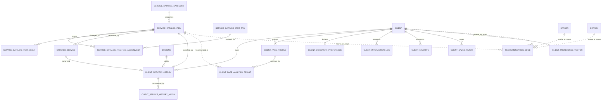

# 02 — Product Requirements Document (PRD)

> **This is the master document.** All other files support and expand it.
> Product: **Kraseena** (placeholder name — see `01_vision-and-scope.md`).
> Scope of this PRD: the **MVP** plus the immediate phases, with decisions frozen and open questions flagged.

---

## 1. Product summary

Kraseena is a **multi‑tenant SaaS platform** for the Syrian grooming and beauty industry. It gives **owners** an operational management engine (storefront, seats, hours, staff, jobs) and gives **clients** a **visual, location‑aware discovery and booking** experience across two universes — **Men's Grooming** and **Women's Beauty**. Independent **barbers/stylists** are first‑class and can operate freelance (including **at‑home**) or affiliate with shops.

The product is anchored on four invariants — **Branch‑First, Barber‑Standalone, Backend‑Driven UI, Two Universes** — defined in `01_vision-and-scope.md`.

---

## 2. Goals & non‑goals

### Goals (MVP)
1. Let any shop create a **branch storefront** (profile, hours, location, services, prices) in minutes.
2. Let clients **discover the nearest** relevant shops and **book against a visual floor plan**.
3. Make **growth painless**: one shop → many branches with zero data migration (Branch‑First).
4. Treat **barbers as independent**: freelance, at‑home, and/or affiliated with shops.
5. Support **bilingual** content and **multi‑currency** pricing under volatile exchange rates.
6. **Never** allow a chair/time‑slot to be double‑booked.

### Non‑goals (now) 🔭
- Offline‑first behavior, map‑provider localization, SMS/WhatsApp gateway engineering.
- Advanced analytics, complex shift scheduling, paid‑vs‑unpaid job mechanics, commission/payment processing.
- A full applicant‑tracking system (ATS) or LinkedIn‑style network.
- In‑app payments / wallet (booking is a *reservation*, not a transaction, for MVP).

---

## 3. User types (personas)

Full narratives in `03_persona-journeys.md`; permission rules in `04_house-rules.md`.

| Persona | Who they are | Primary need | Lives in |
|---|---|---|---|
| **Client** | A man or woman seeking grooming/beauty | Find a nearby shop, see who's free, book without waiting | Mobile app |
| **Brand Owner** | Owns the business (1 → many branches) | Operational control across all branches; grow without pain | Admin panel |
| **Branch Manager** | Runs day‑to‑day at one branch | Manage that branch's seats, hours, staff, bookings | Admin panel |
| **Barber / Stylist** | Independent professional | Own profile & services; work freelance/at‑home and/or for shops; find work | Mobile app (+ light panel) |
| **Platform Admin** | Kraseena operator | Onboard tenants, moderate, manage currencies & flags | Admin panel |

---

## 4. MVP scope (detailed)

### 4.1 Storefront & hierarchy ✅
- Create a **Brand**; the system auto‑creates **exactly one Branch** (Branch‑First).
- Branch carries: bilingual name, **gender category** (`men_only` / `women_only` / `unisex`), location (coordinates), opening/closing hours, settings.
- Define **chairs/seats** for the branch, each with a position for the visual floor plan and a status (`available` / `occupied` / `maintenance`).
- Define **services** (bilingual name, price, currency, optional `at_home`).

### 4.2 Discovery & search ✅
- Client **home feed** ranks shops by **proximity**, filtered by the chosen **universe**.
- **Search bar queries Branches first** (a client visits a *building*, not a corporation), matching **branch name + brand name + tags** together, and **also surfaces freelance barbers** (who may have no fixed address). See [§7 Resolved Decisions](#7-resolved-decisions).

### 4.3 Visual floor plan + booking ✅
- Opening a branch shows a **top‑down floor plan**: abstract shapes + chairs colored by live status (**green = free now**).
- Tapping a free chair reveals the **linked barber** (if any) and the relevant **services**, then opens a **booking** for a time slot.
- A client who prefers a **specific barber** can book **by that barber** rather than by chair.
- **Double‑booking is impossible** (see NFR §9 and `04_house-rules.md`).

### 4.4 Standalone & at‑home barbers ✅
- A barber owns a profile, portfolio, settings, and **their own services**.
- A **freelancer** can offer **at‑home** services with a travel radius; at‑home booking captures the **client's location** instead of a floor‑plan chair. 🟡 *exact checkout flow is an open decision.*

### 4.5 Bilingual & currency ✅
- All user‑facing names/descriptions are **translatable (Arabic + English)** with fallback.
- A **base currency** per brand; services priced in a currency; a global **exchange‑rate** layer converts **on the fly**. A shop may opt to **show both** currencies.

### 4.6 Roles & access ✅
- Brand Owner > Branch Manager > Barber > Client, plus Platform Admin (see `04_house-rules.md`).

### 4.7 Reviews 🟢 (early Phase 2)
- **Two‑way** after a completed appointment: client rates shop; shop rates client.

### 4.8 Simple jobs & invitations 🟢 (early Phase 2)
- A branch can **post a job** (open/closed). A barber taps **Apply** → a snapshot of their profile reaches the owner's dashboard. *No ATS.*
- A shop can **invite** a barber to affiliate; the barber **accepts/rejects**.

---

## 5. Phasing

| Phase | Theme | Includes |
|---|---|---|
| **Phase 1 — Core Engine** ✅ | Make a shop real and bookable | Storefront, Branch‑First hierarchy, seats, geolocation discovery, visual floor plan, booking, standalone/at‑home barbers, bilingual, currency, double‑booking protection, roles |
| **Phase 2 — Trust & Talent** 🟢 | Build trust and the B2B loop | Two‑way reviews, simple job board, employee invitations |
| **Phase 3 — Power & Polish** 🟠 | Depth for serious operators | Advanced analytics, richer barber portfolios, owner‑editable floor‑plan designer |
| **Later** 🔭 | Resilience & growth bets | Offline mode, map localization, richer notifications, paid/unpaid jobs, complex shifts, payments |

---

## 6. Monetization & feature flags

**Model:** Freemium Feature Gate, enforced by per‑brand **feature flags** (a simple set of on/off switches, e.g. `multi_branch`, `job_board`, `floor_plan_designer`).

| Tier | Unlocks |
|---|---|
| **Free** | Micro‑site, basic hours, location, single‑chair discovery, basic booking |
| **Premium** | **Multi‑branch management**, **job‑board posting**, and (Phase 3) **custom floor‑plan designer** |

**Rules of the gate** (full list in `04_house-rules.md`):
- A free brand may hold **only one branch**; creating a second requires the `multi_branch` flag.
- Posting a job requires the `job_board` flag.
- **Freelance barbers cannot access salon‑only gates** (multi‑branch monetization is meaningless for an individual).
- Flags are **read at the moment of action**, so upgrades/downgrades take effect immediately.

---

## 7. Resolved decisions

These were open during brainstorming and are now **✅ decided**.

1. **Search targets Branches (plus freelancers), not Brands.** Clients need distance, seats, and booking for the **specific building** nearest them. The query matches branch + brand + tags, and **unions in freelance barbers** so independents are discoverable even without a fixed address.
2. **Branch‑First invariant.** No "shop without a branch." Growth = add a branch. This eliminates the single→multi‑branch migration entirely.
3. **Barber is a standalone entity** linked to brands/branches through a **flexible affiliation layer** (a barber may affiliate with *many* shops, or none). Leaving a shop never deletes the barber's own data.
4. **Services are owned by either a brand or a barber** (so freelancers have menus too), with an **at‑home** option.
5. **Backend‑driven visual floor plan.** The backend describes the layout; the app draws it. Green = free now; tap → barber + services → book.
6. **Two universes with a gender category** on every branch; unisex appears in both.
7. **Currency engine, not hard‑coded prices.** Base currency + exchange layer + optional dual display.
8. **Double‑booking is structurally impossible** (see NFR §9).
9. **Each Brand, Branch, Barber, and Client owns a Settings record** (language, notifications, display currency, theme/universe, price‑display mode).

---

## 8. Open decisions (owed by the product owner) 🟡

> Listed so they are not forgotten. Each blocks or shapes a piece of build.

1. **At‑home checkout:** when booking an at‑home barber, does the client drop a **map pin / coordinates** at checkout (vs. picking a chair)? What address detail is required?
2. **Unisex floor management:** how does a unisex shop represent **separate men's / women's sections** of its physical floor within one dashboard — two floor plans, or zones within one?
3. **Owner‑editable floor‑plan designer:** build a **drag‑and‑drop** chair editor in the admin panel (Phase 3), or have admins position chairs via simpler inputs for MVP?
4. **Permission granularity:** the exact split of capabilities between **Brand Owner** and **Branch Manager** (e.g., can a manager edit prices? post jobs? manage affiliations?). Baseline proposed in `04_house-rules.md`; confirm.
5. **Live queue vs. static booking:** does MVP show **real‑time seat status** (a chair flips to green/red live) or only **scheduled** bookings? (Affects how "green now" is computed.)
6. **Booking granularity:** fixed time slots vs. service‑duration‑based slots; cancellation/no‑show window.
7. **Review eligibility:** can either side review only **after a completed** appointment? How are disputes/no‑shows handled?
8. **Identity model for barbers:** is every barber also a platform user account from day one, and can one person be **both** a client and a barber?

---

## 9. Non‑functional requirements (NFRs)

- **No double‑booking (hard guarantee).** Concurrent attempts on the same chair + slot must resolve so that **exactly one** succeeds; the loser sees a clear "this seat was just taken." (Implementation note for engineering — *not part of these docs* — is row‑locking inside a transaction; captured here only as a **requirement**.)
- **Bilingual everywhere** with graceful fallback (never show an empty label).
- **Multi‑tenant isolation:** one brand can never see or affect another brand's data.
- **Stable identifiers:** entities use non‑guessable identifiers suitable for public URLs/APIs.
- **Performance for discovery:** proximity search must feel instant on a typical phone.
- **Auditability of affiliations & bookings:** status changes (invite → active → terminated; booked → completed/cancelled) are traceable.
- **Reasonable resilience** for MVP — but **offline mode is explicitly out** for now (🔭).

---

## 10. Risks & mitigations

| Risk | Impact | Mitigation |
|---|---|---|
| Owners resist any subscription | Low supply | Generous **free** tier; charge only for clear‑value gates (multi‑branch, jobs) |
| Currency swings make prices look wrong | Lost trust | **Base currency + live exchange**, optional dual display; prices never hard‑coded |
| Double‑booking embarrasses shops | Churn | Hard structural guarantee (NFR §9) |
| Scope creep from "Later" items | Missed launch | Items quarantined as 🔭 in `01` and `02`; revisit only post‑MVP |
| Cold‑start (empty marketplace) | No demand | Lead with the **management engine**; the marketplace is a byproduct that fills as shops onboard |
| Barber data lost when leaving a shop | Pro distrust | **Standalone barber** invariant; affiliations are links, not ownership |
| Unisex shops confuse the universe filter | Bad UX | Unisex appears in **both** universes; clarify floor sectioning (Open Decision #2) |

---

## 11. Glossary & models

- Vocabulary: `05_domain-glossary.md`
- Entities (plain English) + build priority order + abstract relationships: `06_entity-model-abstract.md`
- Flows: `07_user-flows.md` · Edge cases: `08_edge-cases.md`
- System shape (C4): `09_c4-context.md`, `10_c4-containers.md`
- Backend architecture (C4 Level 3): `11_backend-architecture.md`
- Implementation gaps: `12_implementation-prd.md`
- Recommendation module (Phase 5): `05_recommendation-prd.md`

---

## 12. Client Intelligence Engine

> Migrated from the standalone `prd.md`. This section extends the MVP scope with a personalized grooming discovery platform. Architecture-aligned version lives in `11_backend-architecture.md` §5.

### 12.1 Context & Scope

Dorak currently operates a transactional core: brands own branches, branches own chairs, clients book chairs/barbers, and reviews build trust. Discovery is powered by proximity and universe filtering.

This section introduces the **Client Intelligence Layer** — a system that transforms Dorak from a booking utility into a personalized grooming discovery platform. It comprises five subsystems:

1. **Canonical Service Catalog** — A platform-wide taxonomy of service types (haircut styles, treatments) that barbers reference instead of inventing free-text entries.
2. **Client Service History** — A durable journal of what was actually performed on the client, enabling repeat-style bookings and portfolio tracking.
3. **Face-Profile & AI Onboarding** — Clients upload face photos; an AI model (3rd-party or internal Python service) analyzes face shape and recommends compatible styles.
4. **Interaction Tracking & Feedback Loop** — Captures every discovery interaction (views, searches, favorites) to fuel adaptive ranking.
5. **Graph-Based Recommendation Engine** — Replaces pure proximity ranking with a composite score derived from client preferences, style affinities, and behavioral edges.

### 12.2 Gap Analysis

| ID | Gap | Business Impact |
|----|-----|-----------------|
| G1 | **No canonical service taxonomy.** | Clients cannot search for "Fade" or "Layered Bob" as a platform concept. Barbers duplicate naming inconsistently. |
| G2 | **No client service history journal.** | Cannot rebook "the same cut as last time." No data for personalization. |
| G3 | **No face-profile system.** | AI-driven style recommendations are impossible without a structured face-shape data model. |
| G4 | **No interaction tracking.** | Discovery is "blind" — we do not learn from what users view, skip, or favorite. |
| G5 | **No recommendation graph.** | Ranking is purely geographic. Cannot suggest "clients like you chose this barber/style." |
| G6 | **No favorite/bookmark system.** | Users cannot save shops, barbers, or styles for later. Low engagement signal. |

### 12.3 Storage Architecture Decision

**Migrate from MySQL to PostgreSQL with the `pgvector` extension. Single database, no MongoDB. Use normalized tables, `vector` columns for embeddings, `JSON` for flexible metadata, and `fullText` indexes for bilingual keyword search.**

| Concern | PostgreSQL + pgvector | MySQL + JSON (Previous) | MongoDB (Rejected) |
|---------|----------------------|------------------------|-------------------|
| **Vector Search** | Native `whereVectorSimilarTo()` + HNSW indexes. Directly in query builder. | JSON column + manual scoring only. | Second connection, fragile cross-db transactions. |
| **Full-Text Search** | `whereFullText()` with `to_tsvector`, relevance scoring, stemming. | FULLTEXT indexes only on plain text columns. | — |
| **AI SDK Integration** | `laravel/ai` package: `SimilaritySearch` tool, `rerank()`, `Embeddings::for()`, all first-party. | No native AI integration. | Requires separate SDK. |
| **Laravel 13 Native** | Vector + full-text search built into query builder. | Community packages only. | No Laravel-native driver. |
| **Team Velocity** | Same Eloquent ORM, migrations, transactions. | No learning curve (status quo). | Learning MongoDB + new ORM. |

**Why PostgreSQL now:** Laravel 12 had no native vector support. **Laravel 13 changes this** with `$table->vector()`, `$table->vectorIndex()`, `whereVectorSimilarTo()`, `whereFullText()`, `rerank()`, and `SimilaritySearch` tool — all first-party, zero-external-service.

### 12.4 Domain Model — New Entities

> Naming Convention: Every entity uses PascalCase, ends with `Model`, and uses `HasUuids`. Translatable fields use `Spatie\Translatable\HasTranslations`. Full entity definitions in `06_entity-model-abstract.md`.

**15 new entities across 5 modules:**

| Module | Entities |
|--------|----------|
| **ServiceCatalog** | `ServiceCatalogCategoryModel`, `ServiceCatalogItemModel`, `ServiceCatalogItemTagModel`, `ServiceCatalogItemTagAssignmentModel`, `ServiceCatalogItemMediaModel` |
| **ClientHistory** | `ClientServiceHistoryModel`, `ClientServiceHistoryMediaModel` |
| **ClientFaceProfile** | `ClientFaceProfileModel`, `ClientFaceAnalysisResultModel` |
| **ClientInteraction** | `ClientInteractionLogModel`, `ClientFavoriteModel`, `ClientSavedFilterModel`, `ClientDiscoveryPreferenceModel` |
| **Recommendation** | `ClientPreferenceVectorModel`, `RecommendationEdgeModel` |

Key fields per entity are defined in `06_entity-model-abstract.md` §6 (Client Intelligence Entities).

### 12.5 Feature Requirements

#### Service Catalog & Taxonomy
| ID | Requirement | Priority |
|----|-------------|----------|
| SC-1 | Platform admins can CRUD categories and items via Filament Admin Panel. | ✅ Must |
| SC-2 | Items support bilingual name/description, default duration, typical price range, and a `metadata` JSON spec sheet. | ✅ Must |
| SC-3 | Items support multiple tags via `ServiceCatalogItemTagModel`. | ✅ Must |
| SC-4 | Items support media gallery via `ServiceCatalogItemMediaModel`. | 🟢 Should |
| SC-5 | Barbers and Brands can optionally link their `OfferedServiceModel` to a catalog item via nullable `catalog_item_id`. Free-text services remain valid. | ✅ Must |
| SC-6 | Clients can browse the catalog by category, tag, universe, and face-shape suitability. | 🟢 Should |

#### Client Service History
| ID | Requirement | Priority |
|----|-------------|----------|
| HIST-1 | When a booking status transitions to `completed`, the system auto-creates a history record within the same transaction. | ✅ Must |
| HIST-2 | Clients can view their history as a chronological timeline ("My Styles"). | ✅ Must |
| HIST-3 | Clients can upload before/after photos to a history entry. | 🟢 Should |
| HIST-4 | Clients can add private notes and a private rating to a history entry. | 🟢 Should |
| HIST-5 | Clients can initiate a rebooking directly from a history entry. | 🟢 Should |

#### Face Profile & AI Onboarding
| ID | Requirement | Priority |
|----|-------------|----------|
| FACE-1 | Clients can upload face photos (min 0, max 5). Exactly one may be marked `is_primary`. | 🟢 Should |
| FACE-2 | Uploaded photos are queued for asynchronous AI analysis. | 🟢 Should |
| FACE-3 | AI analysis results stored with version tracking and source attribution. | 🟢 Should |
| FACE-4 | System suggests catalog items based on `recommended_catalog_item_ids` from the latest analysis. | 🟢 Should |
| FACE-5 | Clients can dismiss a recommendation, recording negative feedback. | 🔭 Later |

#### Interaction Tracking & Favorites
| ID | Requirement | Priority |
|----|-------------|----------|
| INT-1 | Every branch view, barber view, catalog item view, search query, and favorite action is recorded. | ✅ Must |
| INT-2 | The `context` JSON captures the active universe, applied filters, search query, and screen name. | ✅ Must |
| INT-3 | Clients can favorite/unfavorite branches, barbers, brands, and catalog items. Favorites are **strictly private**. | ✅ Must |
| INT-4 | Clients can save filter configurations for quick reuse. | 🟢 Should |
| INT-5 | A nightly batch job processes interaction logs to update preference vectors and recommendation edges. | 🟢 Should |

#### Discovery Filters & Recommendations
| ID | Requirement | Priority |
|----|-------------|----------|
| REC-1 | The discovery API accepts new filters: `catalog_item_ids`, `available_now`, `price_range`, `rating_min`, `face_shape_compatible`. | ✅ Must |
| REC-2 | Discovery results ranked by composite score: proximity + preference match + trending weight. | 🟢 Should |
| REC-3 | Recommendation edges populated by favorites, booking history, catalog item similarity, face-shape compatibility. | 🟢 Should |
| REC-4 | Adaptive preference tuning: consistent filter patterns adjust the client's vector automatically. | 🔭 Later |
| REC-5 | Search surfaces results based on catalog item tags and face-shape compatibility. | 🟢 Should |

### 12.6 Relationship Diagram

### 12.7 Extended House Rules

- **CAT-1.** If a `ServiceCatalogItemModel` exists, then `OfferedServiceModel` **may** reference it via `catalog_item_id`, but is **not required** to. Free-text services remain valid.
- **CAT-2.** If a `ServiceCatalogItemModel` is deactivated (`is_active = false`), then existing `OfferedServiceModel` references remain valid, but new references are blocked.
- **HIST-1.** If a booking status transitions to `completed`, then a `ClientServiceHistoryModel` record **must** be auto-generated inside the same database transaction.
- **HIST-2.** If a client deletes their account, then `ClientServiceHistoryModel` records are **anonymized** (`client_id` set to `null`) but retained for aggregate recommendation integrity.
- **HIST-3.** A barber has **full read access** to a client's service history when that client has an active or upcoming booking with them. Read-only, scoped to booking context.
- **FACE-1.** If a client uploads a face photo, the photo is **never** publicly visible. Used solely for AI analysis and private recommendations.
- **FACE-2.** A client may upload **minimum 0, maximum 5** face photos. One may be designated `is_primary`.
- **FACE-3.** If a client deletes their account, face photos are purged after a **30-day grace period**.
- **INT-1.** If a client interacts with a discoverable entity, the interaction log **must** capture the active universe and applied filters in the `context` JSON.
- **FAV-1.** `ClientFavoriteModel` records are **strictly private**. No user can see another user's favorites, no public "favorite count".
- **REC-1.** If a recommendation edge weight is computed, it **must** include a `computed_at` timestamp and a `vector_version` so stale edges can be invalidated.
- **REC-2.** Recommendation vector and edge recomputation runs as a **nightly batch job**, not real-time.

### 12.8 Resolved Decisions

| # | Decision | Resolution | Rationale |
|---|----------|------------|-----------|
| **OD-1** | AI Model Ownership | **Hybrid:** Use a proven 3rd-party API if available (e.g., AWS Rekognition, Google Vision). If none exists, build a **Python microservice** (FastAPI). `ClientFaceAnalysisResultModel` stores final labels + confidence scores only. | Avoids vendor lock-in when no good vendor exists. |
| **OD-2** | Face Photo Limits | **Min 0, Max 5 per client.** One may be `is_primary`. Retained for account lifetime + 30-day grace. | Sufficient angles without storage bloat. |
| **OD-3** | Recommendation Compute | **Nightly batch job** for MVP. Processes past 24h of interaction logs. | Protects discovery API latency. Near-real-time is 🔭 Later. |
| **OD-4** | Favorite Privacy | **Strictly private.** No public counters, no social proof. | Syrian market privacy expectations. Social features are 🔭 Later. |
| **OD-5** | History Visibility | **Barber has full read access** to client history when client books with them. Read-only. | Improves personalization without violating privacy. |

### 12.9 Phasing

| Phase | Theme | Deliverables | Est. Duration |
|-------|-------|--------------|---------------|
| **Phase 1 — Catalog Foundation** | Canonical taxonomy | Migrations + Models for ServiceCatalog. Filament Admin CRUD. Update `OfferedServiceModel` with optional `catalog_item_id`. API endpoints. | 1 week |
| **Phase 2 — History Layer** | Client service journal | Migrations + Models for ClientHistory. Auto-creation on booking completion. Client timeline API. Rebooking flow. | 1 week |
| **Phase 3 — Face Profile & AI** | Onboarding intelligence | Migrations + Models for ClientFaceProfile. Upload endpoints. Async analysis queue. Decision point: 3rd-party vs Python service. | 1.5 weeks |
| **Phase 4 — Interaction Graph** | Tracking & favorites | Migrations + Models for ClientInteraction. Instrument all discovery touchpoints. Favorite/unfavorite APIs. Saved filter CRUD. | 1 week |
| **Phase 5 — Intelligence Engine** | Recommendations | Migrations + Models for Recommendation. Nightly batch job. Composite ranking algorithm. A/B testing framework. | 1.5 weeks |

### 12.10 Naming Reference

| Concept | Model Name | Table Name |
|---------|-----------|------------|
| Canonical service category | `ServiceCatalogCategoryModel` | `service_catalog_categories` |
| Canonical service item | `ServiceCatalogItemModel` | `service_catalog_items` |
| Tag on catalog item | `ServiceCatalogItemTagModel` | `service_catalog_item_tags` |
| Tag assignment pivot | `ServiceCatalogItemTagAssignmentModel` | `service_catalog_item_tag_assignments` |
| Media on catalog item | `ServiceCatalogItemMediaModel` | `service_catalog_item_media` |
| Client's performed service record | `ClientServiceHistoryModel` | `client_service_histories` |
| Photo on history entry | `ClientServiceHistoryMediaModel` | `client_service_history_media` |
| Uploaded face photo | `ClientFaceProfileModel` | `client_face_profiles` |
| AI analysis result | `ClientFaceAnalysisResultModel` | `client_face_analysis_results` |
| Client's discovery preferences | `ClientDiscoveryPreferenceModel` | `client_discovery_preferences` |
| Interaction event log | `ClientInteractionLogModel` | `client_interaction_logs` |
| Favorite bookmark | `ClientFavoriteModel` | `client_favorites` |
| Saved filter config | `ClientSavedFilterModel` | `client_saved_filters` |
| Computed preference vector | `ClientPreferenceVectorModel` | `client_preference_vectors` |
| Recommendation graph edge | `RecommendationEdgeModel` | `recommendation_edges` |