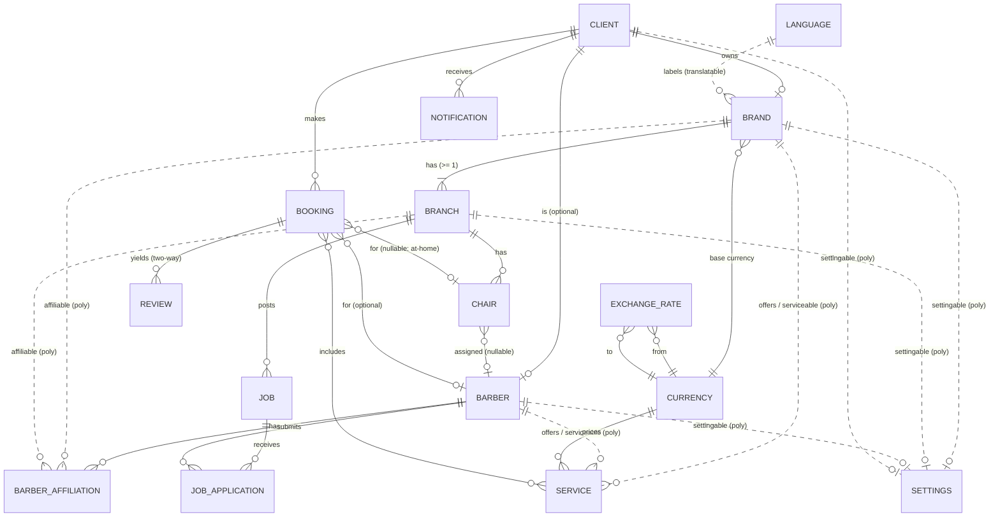
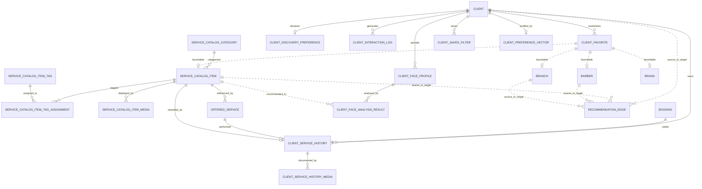

# 06 — Entity Model (Abstract)

> **No database schema, no SQL, no real ERD.** Entities are described as **plain‑English objects with attributes**, followed by an **abstract relationship view**. This is the *vocabulary of things*, deliberately kept above implementation so nothing gets locked in too early.
> Definitions for each term: `05_domain-glossary.md`. Behavior: `04_house-rules.md`.

How to read an attribute's *nature* (plain words, not code):
- **identifier** — a stable, non‑guessable id (suitable for public links).
- **translatable** — held in **both Arabic and English**, with fallback.
- **flag** — a simple yes/no.
- **status** — one value from a short fixed list.
- **link** — points to another entity.
- **money / rate / coordinates / timestamps** — exactly what they sound like.

---

## 1. Build priority order (which entities to model first)

Build bottom‑up: foundations first, then the things that depend on them. Feature flags ride on **Brand** from the start but are *enforced* progressively.

| Tier | Entities | Why first |
|---|---|---|
| **0 — Foundations** | **Client**, **Language**, **Currency**, **Exchange Rate** | Identity, bilingual content, and money must exist before anything is priced or owned. |
| **1 — Tenant core** | **Brand**, **Branch**, **Settings** | The Branch‑First spine. A Brand is meaningless without its first Branch. Settings attach to many things, so define early. |
| **2 — People** | **Barber**, **Client**, **Barber Affiliation** | Barber is standalone; the affiliation link connects barbers to brands/branches. |
| **3 — Catalog** | **Service** | Owned by a Brand *or* a Barber; needs Currency (Tier 0) to be priced. |
| **4 — Physical & UI** | **Chair / Seat**, **Floor Plan (view)** | Chairs belong to a Branch and anchor the visual floor plan. |
| **5 — Transactions** | **Booking** | The core action; depends on Chairs/Barbers/Services. Carries the no‑double‑booking guarantee. |
| **6 — Trust & talent** | **Review**, **Job**, **Job Application** | Built on completed bookings (reviews) and on branches/barbers (jobs). |
| **7 — Later** 🔭 | **Notification** | Kept minimal for MVP. |

---

## 2. The entities (plain‑English objects)

### Foundations

**Client**
- identifier
- name, contact (phone and/or email)
- credentials (managed by auth — *not detailed here*)
- one or more **roles** (Brand Owner, Branch Manager, Barber, Client, Platform Admin)
- links to the profile(s) this client *is*: optionally a **Barber**
- a **Settings** record
> Note: one human can wear more than one hat (e.g., be both a Client and a Barber). 🟡 confirm in PRD Open Decision #8.
> Auth entities (Client, Barber, Branch, Admin) are detailed in `12_identity-auth-onboarding.md`.

**Language**
- identifier (e.g., `ar`, `en`)
- name, direction (right‑to‑left / left‑to‑right)
- whether it's the default
> The app ships **Arabic + English**; translatable fields resolve against this.

**Currency**
- identifier (e.g., `SYP`, `USD`)
- name (translatable), symbol
- whether it's a platform default

**Exchange Rate**
- **link**: from‑Currency
- **link**: to‑Currency
- **rate** (the conversion factor)
- effective timestamp (so the latest rate is used)

---

### Tenant core

**Brand** *(the tenant)*
- identifier
- **link**: Owner (a Client)
- name (**translatable**), logo, description (translatable)
- **link**: base Currency
- **feature flags** (e.g., multi‑branch, job board, floor‑plan designer — on/off)
- a **Settings** record
- **always owns ≥ 1 Branch**

**Branch** *(a physical location)*
- identifier
- **link**: Brand (deleting the Brand deletes its Branches)
- name (**translatable**), description (translatable)
- **link**: Manager (a Client), optional
- **gender category**: men‑only / women‑only / unisex
- coordinates (latitude/longitude) + address (translatable)
- opening/closing hours
- a **Settings** record (branch‑level overrides)
- owns **Chairs**

**Settings** *(attaches to many owners)*
- identifier
- **owner link (polymorphic)**: a Brand, Branch, Barber, **or** Client
- preferences: preferred Language, notification choices, display Currency, theme/universe, **price‑display mode** (single vs. dual currency)
> One human/shop‑level bag of preferences, reused across entity types — see [§4 Polymorphic links](#4-the-two-polymorphic-links).

---

### People

**Barber / Stylist** *(standalone)*
- identifier
- **link**: User
- name (**translatable**), bio (translatable), portfolio (photos)
- **is‑freelancer** (flag)
- travel radius (for at‑home), optional
- rating (derived from reviews)
- a **Settings** record
- owns their **own Services**
- has **Affiliations** (to brands/branches), zero or many
> Independent: leaving a shop ends only the **Affiliation**, never the Barber.

**Client / Customer**
- identifier
- **link**: User
- name, preferred **Universe**
- saved/last location, optional
- rating (derived from shop→client reviews)
- a **Settings** record
- has **Bookings** and **Reviews**

**Barber Affiliation** *(the flexible link)*
- identifier
- **link**: Barber
- **affiliable link (polymorphic)**: a **Brand** *or* a **Branch**
- **status**: pending / active / terminated
- optional: commission rate (a future SaaS extra)
- timestamps (invited, accepted/ended)
> Lets one Barber belong to **many** shops at once, at either the brand or branch level.

---

### Catalog

**Service**
- identifier
- **owner link (polymorphic)**: a **Brand** *or* a **Barber**
- name (**translatable**), description (translatable)
- price (**money**) + **link**: Currency
- duration, optional
- **at‑home** (flag)
- active (flag)

---

### Physical & UI

**Chair / Seat**
- identifier
- **link**: Branch
- **link**: Barber, optional (the station's current/assigned barber)
- **UI metadata**: shape + position on the floor plan; interactive or decorative
- **status**: available / occupied / maintenance
- label/number, optional

**Floor Plan** *(a derived view, not necessarily a stored thing)*
- canvas size (width/height/unit)
- a list of **components**: each is a Chair (interactive, colored by status, may carry the linked barber) or a static decoration (waiting area, mirror, etc.)
> This is **assembled by the backend** from a Branch's Chairs + UI metadata and **drawn by the app** (Backend‑Driven UI). Whether any of it is persisted vs. computed on request is an implementation choice, left open.

---

### Transactions

**Booking / Reservation**
- identifier
- **link**: Client
- **link**: Chair, optional *(empty for at‑home)*
- **link**: Barber, optional *(set when booked "by barber" or at‑home)*
- **link**: Service(s)
- **time slot**
- **status**: booked / completed / cancelled / no‑show
- at‑home location (coordinates), optional 🟡 *(checkout detail is an Open Decision)*
- timestamps
> **Hard rule:** the same **Chair + time slot** can never be held twice — exactly one wins (`04_house-rules.md` E1; NFR in `02_prd.md` §9).

---

### Trust & talent

**Review** *(two‑way)*
- identifier
- **link**: Booking *(must be completed)*
- **author (polymorphic)**: a Client *or* a Brand/Branch
- **subject (polymorphic)**: the **other** side
- rating + comment (text)
- timestamps
> Same shape used both ways: client→shop and shop→client.

**Job**
- identifier
- **link**: Branch
- title + description (**translatable**)
- **status**: open / closed
- *(paid‑vs‑unpaid is **out** for MVP — `04_house-rules.md` G2)*

**Job Application** *(a lightweight snapshot — not an ATS)*
- identifier
- **link**: Job
- **link**: Barber
- **profile snapshot** (the barber's key details at apply time)
- **status**: submitted / seen
- timestamps

---

### Later 🔭

**Notification** *(minimal for MVP)*
- identifier
- **recipient link**: a Client
- type (invite, application, booking update, …)
- payload, read/unread, timestamps

---

## 3. Abstract relationship view

> Relationships only (no attributes) — the *shape* of the model. Dashed links marked **(poly)** are **polymorphic**: one end can point at more than one kind of entity (explained in §4).



> If your Markdown viewer doesn't render Mermaid, read the diagram as the relationship list spelled out in §4 and in `04_house-rules.md`.

---

## 4. The two polymorphic links (the heart of flexibility)

Two relationships intentionally point at **more than one kind of entity**. This is what makes the model flexible without duplication.

### 4.1 Barber Affiliation → Brand **or** Branch
A Barber's affiliation can attach to a **whole Brand** (works across all its branches) **or** a **specific Branch** (locked to one location). The affiliation simply records *which kind* it points to plus its id. This is why:
- a Barber can serve **many** shops at once,
- a freelancer can serve **none**, and
- leaving a shop ends only the **link**, never the Barber.

### 4.2 Service → Brand **or** Barber
A Service can be owned by a **Brand** (the shop's menu) **or** by a **Barber** (a freelancer's personal menu). Same shape, two owners. This is why an independent, at‑home barber can have a full price list without belonging to any salon.

> Two more "shared shapes" use the same idea for convenience: **Settings** attaches to a Brand/Branch/Barber/Client, and a **Review's** author/subject can be a Client *or* a shop (two‑way reviews).

---

## 5. What this model deliberately avoids (for now)

- **No payment/wallet entities** — bookings are reservations for MVP.
- **No shift/roster entities** — complex scheduling is 🔭 Later.
- **No paid/unpaid job mechanics** — jobs are just open/closed.
- **No analytics tables** — derived metrics come later.
- **No commitment to stored vs. computed Floor Plans** — left to implementation.

These omissions are intentional: the model stays small enough to ship and flexible enough to grow.

---

## 6. Client Intelligence Entities (new — 15 entities, 5 modules)

> Migrated from `prd.md` §5. Naming Convention: every entity uses PascalCase, ends with `Model`, and uses `HasUuids`. Translatable fields use `Spatie\Translatable\HasTranslations`. Full migration schemas in `11_backend-architecture.md` §5.8.

### 6.1 Service Catalog & Taxonomy

**ServiceCatalogCategoryModel**
- `id` (UUID)
- `name` (translatable: ar/en)
- `universe` (enum: `men` / `women` / `unisex`) — which universe this category appears in
- `sort_order` (integer)
- `is_active` (boolean)

**ServiceCatalogItemModel** — *The canonical "haircut type" or "service type."*
- `id` (UUID)
- `category_id` (FK → ServiceCatalogCategoryModel)
- `name` (translatable: ar/en)
- `description` (translatable: ar/en)
- `default_duration_minutes` (integer)
- `typical_price_range` (JSON) — cast to `PriceRangeValueObject`
- `metadata` (JSON) — cast to `ServiceCatalogItemMetadataValueObject`:
  ```json
  {
    "suitable_face_shapes": ["oval", "round", "square"],
    "suitable_hair_textures": ["straight", "wavy", "curly", "coily"],
    "maintenance_level": "low",
    "style_period": "modern",
    "formality": "casual"
  }
  ```
- `is_active` (boolean)

**ServiceCatalogItemTagModel** — *Tags for filtering (e.g., "trending", "classic", "low-maintenance").*
- `id` (UUID)
- `name` (translatable: ar/en)
- `slug` (string, unique)

**ServiceCatalogItemTagAssignmentModel** — *Pivot between item and tag.*
- `catalog_item_id` (FK)
- `tag_id` (FK)

**ServiceCatalogItemMediaModel** — *Example images/videos for the style.*
- `id` (UUID)
- `catalog_item_id` (FK)
- `media_url` (string)
- `media_type` (enum: `image` / `video`)
- `sort_order` (integer)

### 6.2 Client Service History

**ClientServiceHistoryModel** — *The durable journal of what was performed.*
- `id` (UUID)
- `client_id` (FK → ClientModel)
- `booking_id` (FK → BookingModel, nullable — for walk-ins without prior booking)
- `barber_id` (FK → BarberModel)
- `branch_id` (FK → BranchModel, nullable for at-home)
- `offered_service_id` (FK → OfferedServiceModel, nullable)
- `catalog_item_id` (FK → ServiceCatalogItemModel, nullable — the canonical style performed)
- `performed_at` (datetime)
- `client_rating` (integer, 1–5, nullable — private rating for the specific service)
- `client_notes` (text, nullable — e.g., "shorter on sides next time")
- `barber_notes` (text, nullable — e.g., "used #2 guard, textured top")
- `metadata` (JSON) — cast to `ServiceHistoryMetadataValueObject`: products used, length settings, color codes
- `created_at` / `updated_at`

**ClientServiceHistoryMediaModel** — *Before/after photos linked to a history entry.*
- `id` (UUID)
- `history_id` (FK)
- `photo_url` (string)
- `photo_type` (enum: `before` / `after` / `reference`)
- `uploaded_at` (datetime)

### 6.3 Client Face Profile & AI Onboarding

**ClientFaceProfileModel** — *A face photo uploaded by the client.*
- `id` (UUID)
- `client_id` (FK → ClientModel)
- `image_url` (string)
- `image_hash` (string, 64 chars — for deduplication)
- `is_primary` (boolean)
- `uploaded_at` (datetime)

**ClientFaceAnalysisResultModel** — *Output of the AI model.*
- `id` (UUID)
- `client_id` (FK)
- `face_profile_id` (FK → ClientFaceProfileModel, nullable — which photo was analyzed)
- `analysis_version` (string) — model version or API version
- `analysis_source` (enum: `third_party_api` / `internal_python_service`)
- `detected_face_shape` (enum: `oval`, `round`, `square`, `heart`, `diamond`, `oblong`, `triangle`)
- `confidence_score` (decimal, 0.00–1.00)
- `detected_features` (JSON) — cast to `FaceAnalysisFeaturesValueObject`
- `recommended_catalog_item_ids` (JSON array of UUIDs) — cast to `RecommendedCatalogItemIdsValueObject`
- `computed_at` (datetime)

### 6.4 Discovery Preferences & Interaction Tracking

**ClientDiscoveryPreferenceModel** — *Explicit preferences collected during onboarding or profile editing.*
- `id` (UUID)
- `client_id` (FK)
- `style_period_preference` (enum: `classic` / `modern` / `no_preference`)
- `maintenance_level_preference` (enum: `low` / `medium` / `high` / `no_preference`)
- `length_preference` (enum: `short` / `medium` / `long` / `no_preference`)
- `price_sensitivity` (enum: `budget` / `moderate` / `premium` / `no_preference`)
- `preferred_max_distance_km` (integer, nullable)
- `updated_at` (datetime)

**ClientInteractionLogModel** — *Immutable behavioral event log.*
- `id` (UUID)
- `client_id` (FK)
- `session_id` (string, 64 chars — groups events into a single discovery session)
- `interaction_type` (enum: `viewed_branch`, `viewed_barber`, `viewed_catalog_item`, `searched`, `favorited`, `unfavorited`, `booked`, `reviewed`, `shared_location`)
- `subject_id` (UUID)
- `subject_type` (string) — polymorphic class name
- `context` (JSON) — cast to `InteractionContextValueObject`: snapshot of filters at time of interaction:
  ```json
  {
    "universe": "men",
    "applied_filters": {"radius_km": 5, "catalog_item_ids": ["uuid1"], "rating_min": 4},
    "search_query": "fade",
    "screen": "explore"
  }
  ```
- `occurred_at` (datetime)

**ClientFavoriteModel** — *Private bookmarks.*
- `id` (UUID)
- `client_id` (FK)
- `favoritable_id` (UUID)
- `favoritable_type` (string) — polymorphic: BranchModel, BarberModel, BrandModel, ServiceCatalogItemModel
- `notes` (text, nullable — e.g., "try this next time")
- `created_at` (datetime)

**ClientSavedFilterModel** — *Named saved searches.*
- `id` (UUID)
- `client_id` (FK)
- `filter_name` (string, e.g., "Barbers within 2km who do fades")
- `filter_configuration` (JSON) — cast to `FilterConfigurationValueObject`
- `created_at` (datetime)

### 6.5 Recommendation Engine

**ClientPreferenceVectorModel** — *Computed dense preference profile.*
- `id` (UUID)
- `client_id` (FK)
- `vector_version` (string) — schema version of the vector
- `vector_data` (vector, 1536 dimensions) — pgvector column storing the client's preference embedding
- `factor_weights` (JSON) — cast to `RecommendationFactorWeightsValueObject`:
  ```json
  {"proximity": 0.3, "preference_match": 0.4, "trending": 0.2, "rating": 0.1}
  ```
- `last_computed_at` (datetime)

**RecommendationEdgeModel** — *Weighted edge in the recommendation graph.*
- `id` (UUID)
- `source_id` (UUID)
- `source_type` (string) — polymorphic
- `target_id` (UUID)
- `target_type` (string) — polymorphic
- `edge_type` (enum: `client_preferred`, `similar_style`, `often_booked_with`, `trending_nearby`, `face_shape_compatible`)
- `weight` (decimal, 0.00–1.00)
- `context` (JSON) — cast to `RecommendationEdgeContextValueObject`
- `computed_at` (datetime)

---

## 7. Client Intelligence Relationship Diagram

> Extended from `prd.md` §7. Dashed lines indicate polymorphic relations.



> This diagram extends the core relationship diagram in §3. The 15 new entities span 5 modules: ServiceCatalog, ClientHistory, ClientFaceProfile, ClientInteraction, Recommendation.

---

## 8. Naming Reference (Client Intelligence)

| Concept | Model Name | Table Name | Notes |
|---------|-----------|------------|-------|
| Canonical service category | `ServiceCatalogCategoryModel` | `service_catalog_categories` | Universe-scoped |
| Canonical service item | `ServiceCatalogItemModel` | `service_catalog_items` | JSON metadata for specs |
| Tag on catalog item | `ServiceCatalogItemTagModel` | `service_catalog_item_tags` | Translatable |
| Tag assignment pivot | `ServiceCatalogItemTagAssignmentModel` | `service_catalog_item_tag_assignments` | |
| Media on catalog item | `ServiceCatalogItemMediaModel` | `service_catalog_item_media` | Polymorphic-ready |
| Client's performed service record | `ClientServiceHistoryModel` | `client_service_histories` | Auto-created on completion |
| Photo on history entry | `ClientServiceHistoryMediaModel` | `client_service_history_media` | before/after/reference |
| Uploaded face photo | `ClientFaceProfileModel` | `client_face_profiles` | Max 5 per client |
| AI analysis result | `ClientFaceAnalysisResultModel` | `client_face_analysis_results` | Stores labels, not raw tensors |
| Client's discovery preferences | `ClientDiscoveryPreferenceModel` | `client_discovery_preferences` | Onboarding/profile |
| Interaction event log | `ClientInteractionLogModel` | `client_interaction_logs` | Immutable |
| Favorite bookmark | `ClientFavoriteModel` | `client_favorites` | Polymorphic, private |
| Saved filter config | `ClientSavedFilterModel` | `client_saved_filters` | Named searches |
| Computed preference vector | `ClientPreferenceVectorModel` | `client_preference_vectors` | Nightly recomputed |
| Recommendation graph edge | `RecommendationEdgeModel` | `recommendation_edges` | Polymorphic source/target |