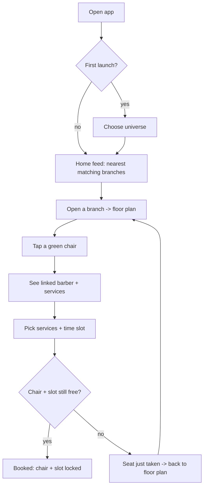
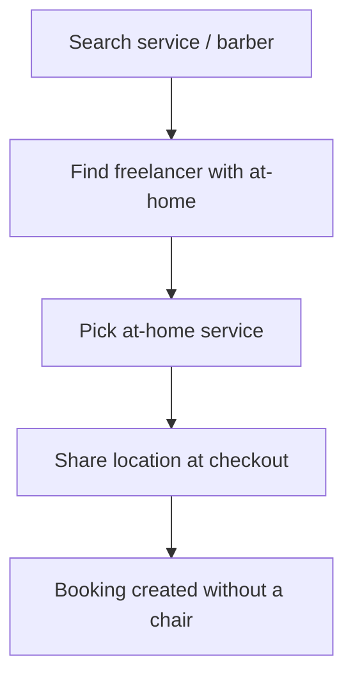
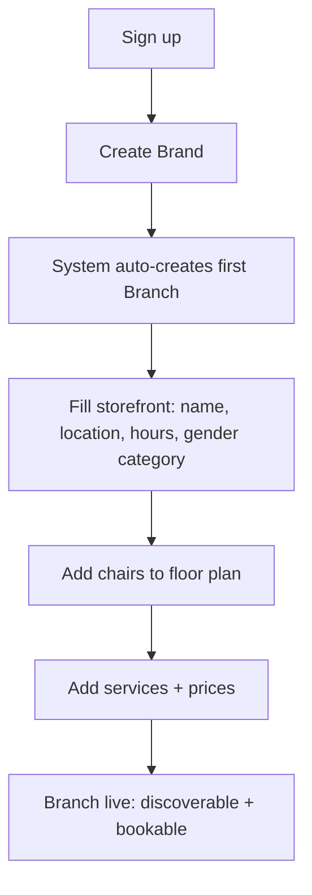
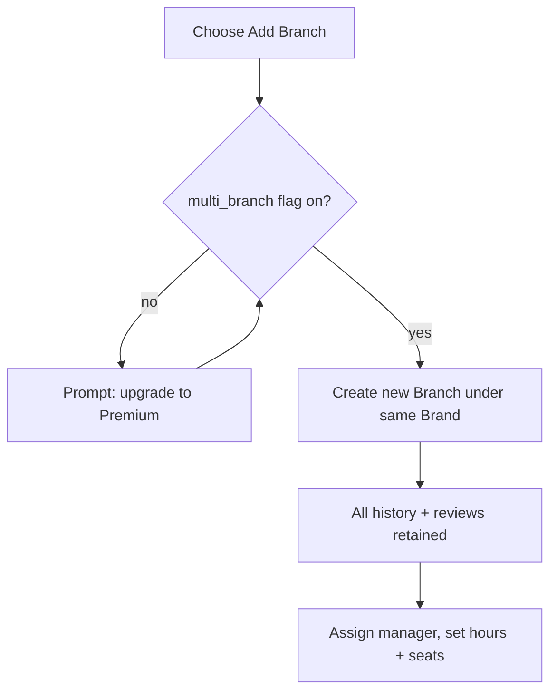
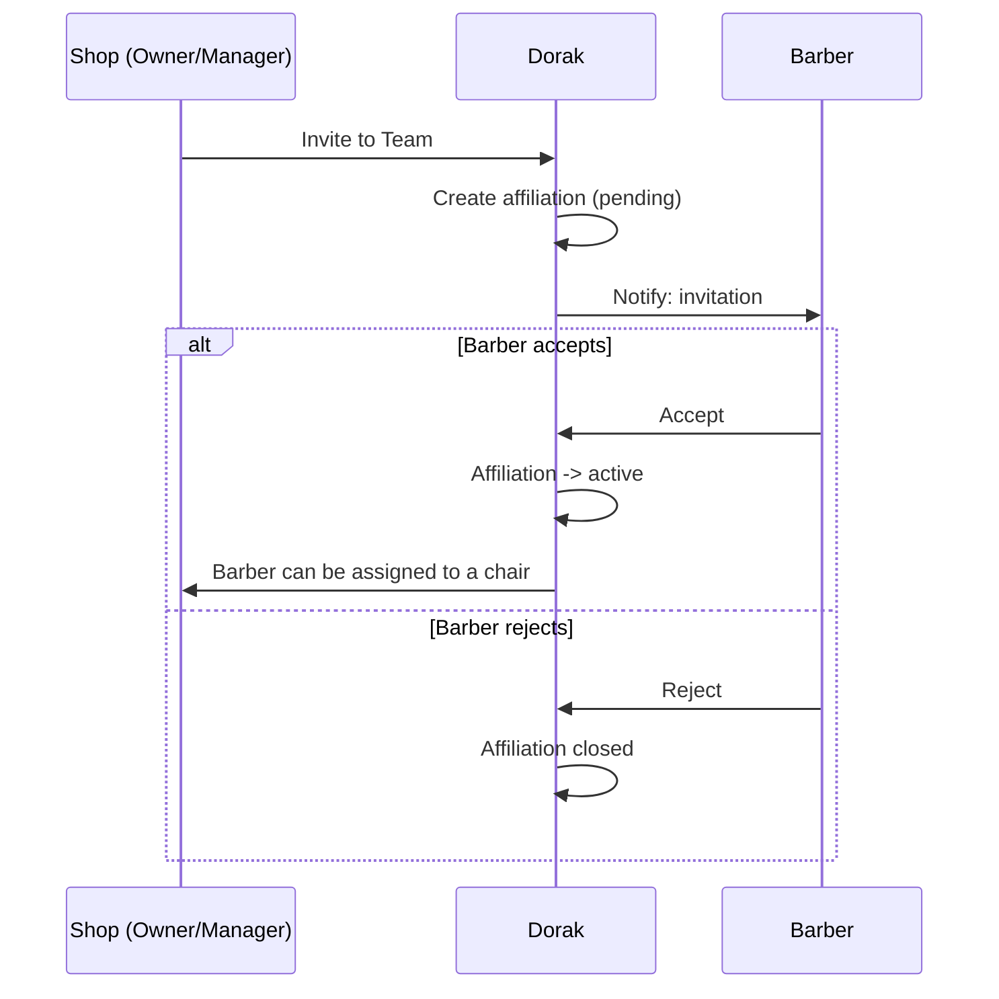
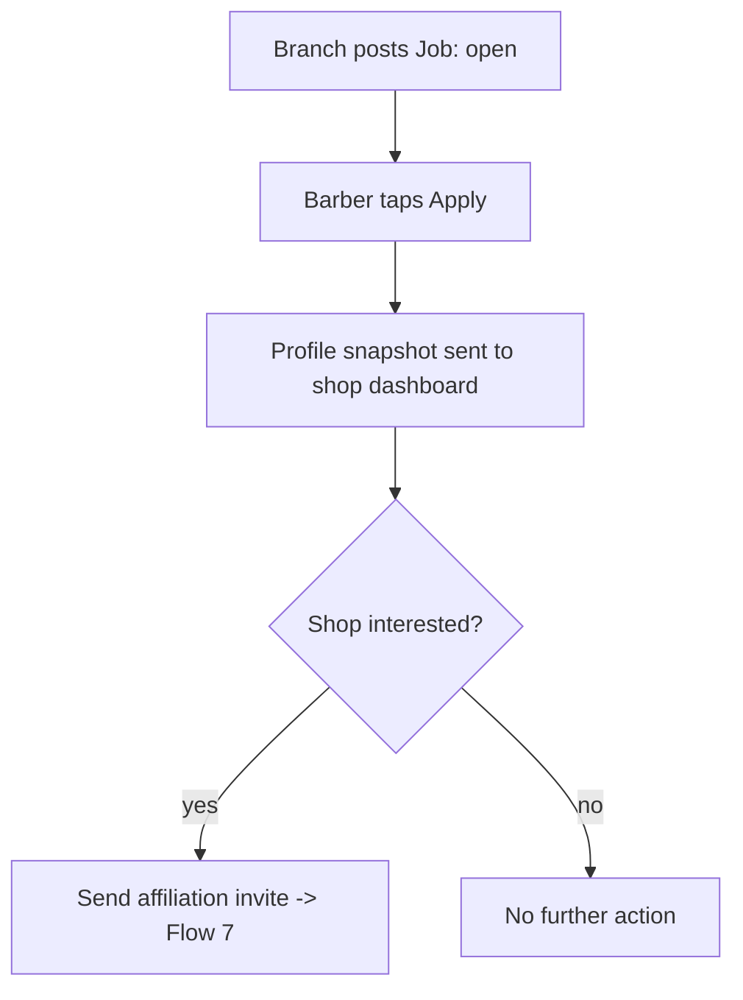
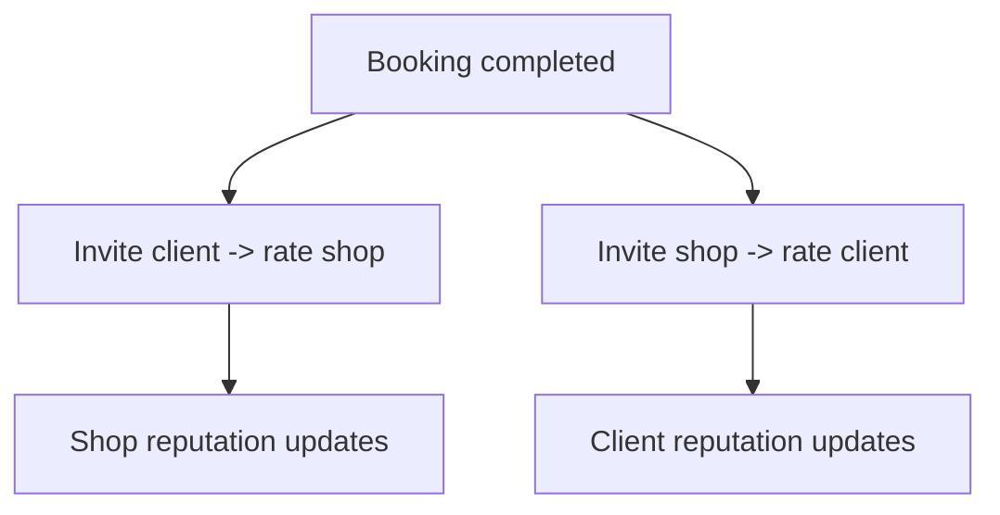
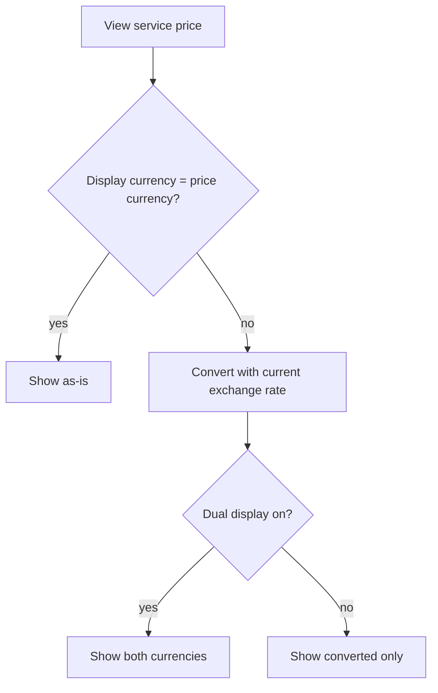

# 07 — User Flows

> **Step‑by‑step interaction flows.** Where stories in `03_persona-journeys.md` show *why*, these show *what happens, step by step*. Diagrams are abstract (flow/sequence), not code. Rules referenced as `[E1]` etc. point to `04_house-rules.md`.

---

## 1. Client — discover & book a chair

1. Client opens the app and (first time) chooses a **Universe** `[J3]`.
2. Home feed shows the **nearest** matching branches `[J4]`.
3. Client opens a branch → sees the **visual floor plan** (green = free now) `[B2]`.
4. Client taps a **green** chair → sees the **linked barber** (if any) + relevant **services** `[B4/B5]`.
5. Client picks service(s); price shows in their currency, optionally dual `[D4/D5]`.
6. Client picks a **time slot** and confirms.
7. System attempts to lock **chair + slot**:
   - if free → **booked**, chair + slot locked to client `[E2]`;
   - if just taken → **"this seat was just taken"** `[E1]`, return to step 3.

---

## 2. Client — book a specific barber (preference‑first)

Some clients follow a barber rather than a chair.

1. Client **searches the barber by name**, or opens their profile from a previous visit.
2. Client sees where the barber is **working** (which branch/chair) and/or their **at‑home** option `[E3]`.
3. Client picks the barber's service + slot.
4. System books **by barber** (and the chair, if at a shop) with the same no‑double‑booking check `[E1]`.

---

## 3. Client — book an at‑home barber

1. Client finds a **freelance** barber offering **at‑home** (via search; freelancers surface even without a fixed address) `[search]`.
2. Client picks an **at‑home** service `[D6]`.
3. At checkout the client **shares their location** (instead of choosing a chair) `[E4]`. 🟡 *exact checkout detail is an Open Decision (`02_prd.md` §8 #1).*
4. Booking is created **without a chair**, carrying the client's location.

---

## 4. Owner — onboarding (Branch‑First)

1. Owner signs up → creates a **Brand**.
2. System **auto‑creates the first Branch** `[A1/A2]`.
3. Owner fills the **storefront**: bilingual name, address/coordinates, hours, **gender category** `[A5]`.
4. Owner adds **chairs** with positions for the floor plan `[B1]`.
5. Owner adds **services** with prices in the base currency `[D1/D2/D3]`.
6. Branch is now discoverable and bookable.

---

## 5. Owner — expand from one branch to many (the non‑event)

1. Owner chooses **Add Branch**.
2. System checks the **multi‑branch** flag `[A3/I2]`:
   - off → prompt to **upgrade to Premium**;
   - on → continue.
3. New Branch is created **under the same Brand** — **all history/reviews stay** `[A4]`.
4. Owner assigns a **Manager** and sets that branch's hours/seats.

---

## 6. Barber — onboard as a standalone professional

1. Barber signs up → builds **profile, portfolio, bio**.
2. Barber adds **their own services** (with prices) `[D1]`.
3. Barber optionally marks **freelancer** + **at‑home** with a travel radius `[C7]`.
4. Barber is now discoverable independently `[search]`, with **no shop required** `[C2]`.

---

## 7. Shop invites a barber → affiliation

1. Manager/Owner opens a barber's profile → **Invite to Team**.
2. An **Affiliation** is created with status **pending** `[G4/G5]`.
3. Barber receives the invite → **accepts** or **rejects** `[G4]`.
   - accept → affiliation **active**; barber can be assigned to a **chair** `[C3/C6]`;
   - reject → affiliation closed; nothing else changes.

---

## 8. Barber applies to a posted job (simple, no ATS)

1. Branch posts a **Job** (open) — needs the **job board** flag `[G1/I2]`.
2. Barber sees it and taps **Apply** `[G3]`.
3. System sends a **profile snapshot** to the shop's dashboard `[G3]`.
4. Shop reviews the snapshot; if interested, it may **invite** the barber (Flow 7).

---

## 9. After the appointment — two‑way review

1. A booking becomes **completed** `[F1]`.
2. App invites **both** sides to review: client → shop, shop → client `[F1]`.
3. Ratings update the shop's and the client's reputation `[F3]`.
4. If the appointment **didn't happen** (no‑show/cancelled), **no review** is allowed `[F2]`.

---

## 10. Price display (currency on the fly)

1. Client views a service.
2. System reads the price + its currency, and the brand's **base currency** `[D2/D3]`.
3. If the client's display currency differs, system **converts using the current exchange rate** `[D4]`.
4. If the shop enabled **dual display**, show **both** `[D5]`.

