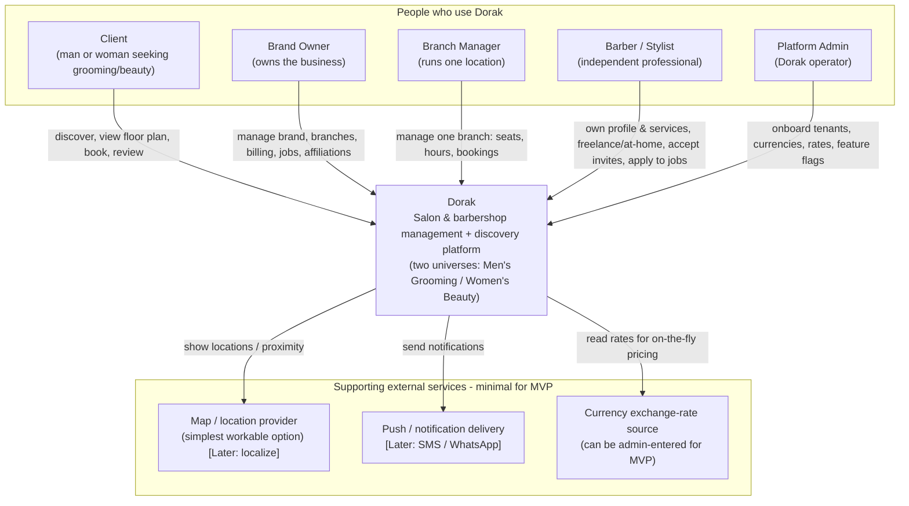

# 09 — C4 Context (Level 1)

> **The system as one box**, and everyone/everything that touches it. No internals here — that's `10_c4-containers.md`. This follows the **C4 model** (Context → Containers). Diagram is abstract; **no code**.

---

## The one‑box view

Dorak is a single system to its users. People interact with it; a few external services support it (kept minimal for MVP).

---

## Actors (who uses it)

- **Client** — discovers nearby shops in their chosen **universe**, books against the **visual floor plan** (or by barber / at‑home), and leaves **two‑way reviews**.
- **Brand Owner** — manages the whole **Brand**: all branches, billing/feature flags, managers, jobs, and barber affiliations.
- **Branch Manager** — manages **one Branch**: its chairs, hours, and bookings — deep but local.
- **Barber / Stylist** — a **standalone** professional: owns profile/portfolio/services, works freelance/at‑home and/or for shops, accepts invites, applies to jobs.
- **Platform Admin** — operates the platform: onboards tenants, maintains **currencies and exchange rates**, and controls **feature flags**.

## Supporting external services (intentionally light for MVP)

- **Map / location provider** — to place shops and rank by **proximity**. Use the **simplest workable option** now; **localization (OSM/Mapbox choice) is 🔭 Later**.
- **Push / notification delivery** — for invites, applications, and booking updates. Keep **minimal** for MVP; **SMS/WhatsApp gateways are 🔭 Later**.
- **Currency exchange‑rate source** — feeds on‑the‑fly conversion. For MVP this can be **admin‑entered rates**; an automated feed is optional later.

> Everything the user explicitly deprioritized (offline mode, map localization, SMS/WhatsApp engineering) lives at this boundary as **Later**, so it doesn't leak into the MVP.

---

## What this level fixes

- Dorak is **one product** with **five kinds of users** and a **small** set of external dependencies.
- The **two‑universe** nature is a property of the system as a whole, not a separate system.
- External dependencies are **swappable and minimal**, protecting the MVP from heavy integration work.

Next: how the one box is built internally → `10_c4-containers.md`.
