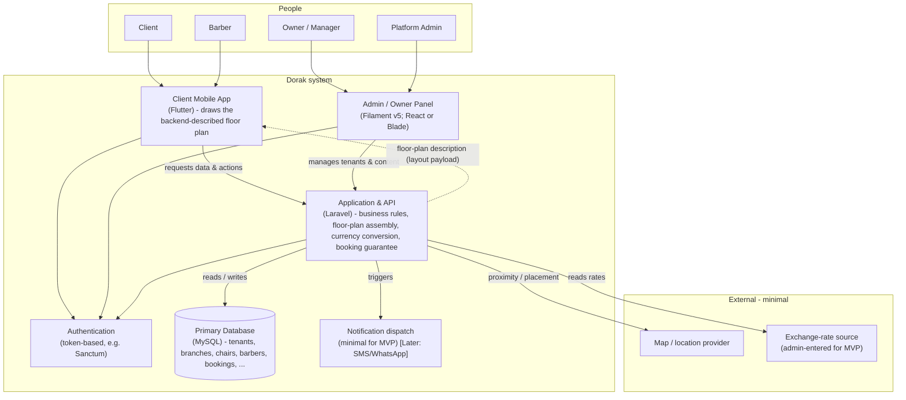

# 10 — C4 Containers (Level 2)

> **Inside the one box.** The major moving parts (the "containers" in C4 terms) and how they talk. This records the **intended technical context** for shared understanding — but contains **no code, no schema, no configuration.** Versions/tools are the owner's choices and should be confirmed at build time.

---

## The container view

---

## The containers (plain English)

### Client Mobile App — *Flutter*
The phone app for **Clients and Barbers**. Its standout job is to **draw the backend‑described floor plan**: it receives a layout description (canvas + components: chairs colored by status, decorations) and renders it as tappable shapes. Tapping a free chair opens booking. It also handles discovery, profiles, at‑home booking (sharing location), reviews, invites, and job applications. It **does not** contain business rules — it asks the API.

### Admin / Owner Panel — *Filament v5 (React or Blade)*
The management surface for **Owners, Managers, and Platform Admins**. Owners manage the brand, branches, hours, chairs, services, jobs, and affiliations; managers manage their single branch; admins manage tenants, currencies, exchange rates, and feature flags. *(A drag‑and‑drop floor‑plan designer here is Phase 3 / 🟡 Open Decision.)* In practice this is delivered as **two runtime‑discovered Filament panels** — `/admin` and `/client` — sharing models, resolvers, and presenters (see `11_backend-architecture.md` §5).

### Application & API — *Laravel*
The **brain**. It owns and enforces every business rule from `04_house-rules.md`, including:
- **Branch‑First** creation (a Brand always gets its first Branch),
- **assembling the floor‑plan description** the app draws (Backend‑Driven UI),
- **on‑the‑fly currency conversion** using the rate layer,
- the **no‑double‑booking guarantee** (the single most important behavior),
- **feature‑flag gating** read at the moment of action,
- **multi‑tenant isolation** so brands never see each other's data.

> **Internal structure (C4 Level 3):** the API is organized **modular‑by‑domain** — one module per aggregate — and every unit of work flows **Action → Handler → EloquentResolver** (no controllers, services, or repositories). Full detail in `11_backend-architecture.md`.

### Authentication — *token‑based (e.g., Sanctum)*
Identifies users and issues tokens. Encodes **role/permission** differences (Owner vs. Manager vs. Barber vs. Client vs. Admin). 🟡 *the exact Owner‑vs‑Manager permission split is an Open Decision.*

### Primary Database — *MySQL*
Stores everything described in `06_entity-model-abstract.md`: tenants (brands), branches, chairs, barbers, affiliations, services, bookings, reviews, jobs, currencies, rates, settings. Entities use **stable, non‑guessable identifiers**. *(This doc names the database technology only — it defines **no schema**.)*

### Notification dispatch — *minimal for MVP*
Sends invites, application alerts, and booking updates. Kept deliberately light now; **SMS/WhatsApp gateway work is 🔭 Later**.

---

## The signature data flow — Backend‑Driven UI

This is the one flow worth understanding at the container level (described, not coded):

1. The **app** asks the **API** for a branch's floor plan.
2. The **API** assembles a **layout description** from that branch's chairs + their UI metadata: a canvas size and a list of components (each chair with shape, position, **live status color**, and any **linked barber**; plus static decorations).
3. The **app** receives this description and **draws** it as tappable shapes — **green = free now**.
4. Tapping a free chair shows the **linked barber + services** and opens **booking**, which the **API** confirms under the **no‑double‑booking** guarantee.

The look is good, but it is **generated centrally** — no per‑shop front‑end work.

---

## Intended technical context (for shared understanding only)

> The owner's stated stack. Recorded so everyone shares a mental model; **none of it is prescribed by these product docs**, and exact versions should be confirmed when building.

| Concern | Intended choice |
|---|---|
| Backend / API | Laravel (owner noted Laravel 13, PHP 8.5 — confirm at build time) |
| Database | MySQL |
| Auth | Token‑based (Sanctum) |
| Identifiers | UUID‑style, non‑guessable |
| Client app | Flutter |
| Admin panel | Filament v5 (React or Blade) |
| Multi‑tenancy | SaaS, per‑brand isolation |
| Hosting | Hostinger (owner's intent) |

---

## What this level deliberately leaves open

- **Stored vs. computed floor plans** — implementation choice.
- **Notification channels** beyond a minimal default — 🔭 Later.
- **Permission granularity** in Auth — 🟡 Open Decision.

> Levels 1–2 (Context, Containers) align the team on the system's shape. **Level 3 (components)** — the module layout and the Action → Handler → EloquentResolver structure — is now documented in `11_backend-architecture.md`. Actual code patterns live in the engineering skills (`../.claude/skills/laravel-baseline/`), not in this product‑doc set.
