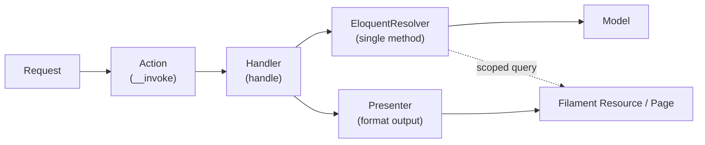

# 11 — Backend Architecture (C4 Level 3: Components & Conventions)

> This is the **component level** that `10_c4-containers.md` deliberately deferred. It describes *how the Laravel backend is structured internally* — the modular layout and the **Action → Handler → EloquentResolver** flow — plus the team's coding conventions. It stays at the **structural / naming / flow** level; **actual code patterns live in the skill** `.claude/skills/laravel-baseline/module-architecture/SKILL.md`, which the Ralph loop reads when building.
> This document **does not restate business logic** — rules live in `04_house-rules.md`, entities in `06_entity-model-abstract.md`.

---

## 0. Reconciliations applied (please confirm)

Three small points were standardized from the draft you provided; correct any that don't match your existing codebase:

1. **Spelling: `EloquentResolver`** (the draft wrote `EloqunetResolver`). If your real classes use the misspelling, say so and it'll be matched verbatim everywhere.
2. **Resolvers are per‑action, single‑method** (matching your evolved approach: "each action … one method," "the EloquentResolver … is only also one method"). The earlier draft showed a **module‑level** resolver (`UserEloquentResolver` owning *all* queries). This doc adopts the **per‑action** form (`ListAllBookingsEloquentResolver`) as the default, because it's the whole point of avoiding fat classes. 🟡 *If you actually want one resolver per module with many query methods, that's a one‑line change to the convention.*
3. **Folders:** Actions in `Http/Actions/`, Handlers in a new `Handlers/`, resolvers kept in `Repositories/` (your draft's folder) — though `Resolvers/` would read truer now that the repository concept is gone. 🟡 *pick one.*

---

## 1. Modular by domain

Every feature is a self‑contained **module** under `modules/{Name}/`, owning its entire vertical slice. You understand one module without reading the other nineteen — the boundary is **cognitive**, not a microservice.

| Layer | Location |
|---|---|
| Migrations | `Database/Migrations/` |
| Models | `Models/{Entity}Model.php` |
| Data access (Eloquent) | `Repositories/{Action}EloquentResolver.php` |
| Presentation | `Presenters/{Name}Presenter.php` |
| HTTP — validation | `Http/Requests/` |
| HTTP — entry points | `Http/Actions/{Action}Action.php` |
| Logic | `Handlers/{Action}Handler.php` |
| Admin UI | `Filament/Admin/{Resources,Pages,Widgets}/` |
| Client UI | `Filament/Client/{Resources,Pages,Widgets}/` |
| Translations | `lang/{en,ar}/{name}.php` |
| Blade | `Resources/views/` |
| Provider | `Providers/{Name}ServiceProvider.php` |

**Modules are not microservices** — they share one DB, one request cycle, and may call each other's resolvers directly.

PSR‑4 autoloading in `composer.json`:

```json
"autoload": { "psr-4": { "Modules\\": "modules/" } }
```

**Dorak's modules** map one‑to‑one onto the aggregates in `06`: `Auth`, `Brand`, `Branch`, `Chair`, `Barber`, `Affiliation`, `Service`, `Booking`, `Review`, `Job`, `Currency`, `Settings` (plus support modules as needed). One module per aggregate keeps the slice clean.

---

## 2. The Action → Handler → EloquentResolver pattern (the core)

**There is no Controller, no Service layer, and no Repository.** Those three become god‑classes as the app grows. Instead, each unit of work is **three single‑purpose, single‑method classes**, named by the **action** (never by the entity + a generic verb):

| Old way (avoided) | This codebase |
|---|---|
| `BookingController@index` | `ListAllBookingsAction` (invokable) |
| `BookingController@store` | `CreateBookingAction` |
| `BookingService` (many methods) | one `…Handler` per action, single method `handle()` |
| `BookingRepository` (many methods) | one `…EloquentResolver` per action, single Eloquent method |

### The three classes
- **Action** — a Laravel **invokable single‑action controller**, but named and filed as an *Action* and never called "Controller." It has Laravel's `__invoke`, stays thin, and does only HTTP concerns: receive the validated request, call its Handler, return via a Presenter/Resource.
- **Handler** — the **logic layer**. Same base name as its action, suffix `Handler`, exactly **one method: `handle()`**. All business logic for that one action lives here; it calls the EloquentResolver for data and enforces the relevant `04` house rules.
- **EloquentResolver** — the **only place Eloquent runs**. Same base name, suffix `EloquentResolver`, exactly **one method**. It contains nothing but the Eloquent operation for that action.

### Why
One action = one HTTP responsibility = one method in each layer. Nothing accumulates methods, so no file grows unbounded. A failed feature is three small files, not a tangled service.

### Worked example — `modules/Booking/`
- `ListAllBookingsAction` → `ListAllBookingsHandler@handle` → `ListAllBookingsEloquentResolver` → `BookingModel`
- `CreateBookingAction` → `CreateBookingHandler@handle` → `CreateBookingEloquentResolver` → `BookingModel`
  - the **no‑double‑booking** guarantee (`04` E1 / `08` EC‑1) lives in this handler + resolver, using the `concurrency-safety` skill's locking‑in‑a‑transaction pattern.

---

## 3. Layering (not strict hexagonal)

Data flows **down**; output formats on the way back up.



**Key rule — resolvers own ALL query logic.** Filament resources never write raw Eloquent. If a resource needs scoped data (e.g. a client panel showing only the current user's bookings), it calls a resolver method, not an inline query. Presenters format for output; Filament reads from presenters for infolists and from resolvers for tables.

---

## 4. Design tenets

### Explicit over magic
- **All module providers listed by name** in `bootstrap/providers.php`. No auto‑discovery.
- **`register()` is always empty.** No bindings, no deferred providers — DI resolves by class name at runtime (concrete classes, see below).
- Every `boot()` guards each `load*` call with `File::exists()` / `File::isDirectory()`. **A missing directory is not an error.**

### `final` everywhere
Every module class — provider, model, resolver, presenter, action, handler, form request — is **`final`**. **No inheritance anywhere.** Share via a **trait** or by **calling a collaborator**, never via a base class.

### No interfaces, no abstract bases
Resolvers, handlers, presenters are **concrete** classes with no `implements` and no shared base. The contract is the **method signature**, not an interface — so you cmd+click straight to the implementation. (Indirection stays low; this is deliberate.)

### `newQuery()` not `Model::query()`
Resolvers always use `$this->model->newQuery()`, never the static facade — so a resolver is testable by constructor‑injecting the model.

---

## 5. Dual Filament panels

Two panels, discovered at runtime from the filesystem:

```
app/Providers/Filament/
  ├── AdminPanelProvider.php    # /admin  — roles: admin, supervisor
  └── ClientPanelProvider.php   # /client — role: user
```

- **Filament is never registered inside module service providers.** The two panel providers scan `modules/{Module}/Filament/{Admin|Client}/{Resources,Pages,Widgets}/`.
- **Auth gating:** each panel's `authMiddleware()` runs the ban‑check middleware; model‑level access via `ClientModel::canAccessPanel()` (or the corresponding auth model for each guard).
- Panel config (id, path, brand, primary color, SPA, `SpatieTranslatablePlugin`) lives in `config/panels.php`.

> Mapped to Dorak's roles (`04` group H): **/admin** serves Platform Admin / Brand Owner / Branch Manager (with policies scoping each); **/client** serves Clients and Barbers. 🟡 *exact role→panel mapping is yours to confirm — it intersects the Open Decision on Owner‑vs‑Manager permissions (`02` §8 #4).*

---

## 6. Naming conventions

| What | Convention | Example |
|---|---|---|
| Models | `{Entity}Model` | `BookingModel`, `BranchModel` |
| Tables | explicit `$table`, snake_case plural | `$table = 'bookings'` |
| Actions | `{Verb}{Subject}Action` (invokable) | `ListAllBookingsAction`, `CreateBookingAction` |
| Handlers | `{Verb}{Subject}Handler` (one method `handle`) | `CreateBookingHandler` |
| Eloquent resolvers | `{Verb}{Subject}EloquentResolver` (one method) | `CreateBookingEloquentResolver` |
| Presenters | `{Module}Presenter` | `BookingPresenter` |
| Service providers | `{Module}ServiceProvider` | `BookingServiceProvider` |
| Translation namespace | snake_case module name | `__('booking::messages.key')` |
| View namespace | kebab‑case module name | `'booking::filament.pages.*'` |
| Migrations | `YYYY_MM_DD_000{N}_create_{table}_table.php` | stamped for ordering |

---

## 7. Translation‑first

Every module ships **both** `lang/en/` and `lang/ar/` from day one. `SpatieTranslatable` handles translatable model attributes (e.g. name, description — the "translatable" fields in `06`); the `LanguageSwitch` plugin toggles `en`/`ar` inside panels. **No hardcoded UI strings** — always translation keys, e.g. `__('booking::labels.time_slot')`.

This is the code‑level enforcement of `04` **J1/J2** (always show the user's language; fall back, never empty) and the bilingual attributes in `06`.

---

## 8. Testing

- **Pest** + **PHPUnit 11**.
- **SQLite `:memory:`** — no external DB required.
- Tests in `tests/Feature/`, `tests/Unit/`, `tests/Integration/`.
- **Factories in each module's `Database/Factories/`.**
- Run: `composer test` (clears config, runs the full suite).

The *policy* for what to test (every house rule → a test; every edge case → a test; every flow → a feature test; the flagship concurrency test) lives in `.claude/skills/laravel-baseline/testing/SKILL.md`. This section only fixes the **stack**.

---

## 9. What's absent on purpose

| Absent | Reason |
|---|---|
| **Controllers / Service layer / Repository layer** | Replaced by single‑method **Action / Handler / EloquentResolver** so no class grows unbounded |
| Service‑container bindings | Concrete classes resolved directly; no interfaces to bind |
| Abstract base classes | `final` + composition over inheritance |
| Most `Routes/web.php` | Filament handles panel routing; Actions are bound where API/web routes are needed |
| Module auto‑discovery | Explicit `providers.php` keeps boot order predictable |
| Filament in `register()` | Panel providers own discovery; modules never touch Filament |
| `app/` features (except providers) | Domain code lives in `modules/`; `app/` is only glue |

---

## 10. Guided tour

```
bootstrap/providers.php                 # Entry: all providers, in explicit order
├── Modules\Auth\...                     # sessions, password reset
├── App\Providers\...                    # rate limiting, model strict mode
├── App\Providers\Filament\...           # Admin + Client panel discovery
└── Modules\{Brand,Branch,Chair,Barber,Affiliation,Service,Booking,Review,Job,Currency,Settings}\...

modules/Booking/                         # one module = one aggregate from 06
├── Providers/BookingServiceProvider.php # loads migrations/lang/views; register() empty; boot() guards with File::exists
├── Models/BookingModel.php              # final Eloquent model
├── Http/
│   ├── Requests/CreateBookingRequest.php   # form-request validation (the input-shaped 04 rules)
│   └── Actions/
│       ├── ListAllBookingsAction.php        # invokable; thin; calls handler
│       └── CreateBookingAction.php
├── Handlers/
│   ├── ListAllBookingsHandler.php           # handle(): logic only
│   └── CreateBookingHandler.php             # enforces E1/E2 via concurrency-safety
├── Repositories/                            # (or Resolvers/) — Eloquent only
│   ├── ListAllBookingsEloquentResolver.php  # one method; newQuery()
│   └── CreateBookingEloquentResolver.php
├── Presenters/BookingPresenter.php          # output formatting
├── Database/
│   ├── Migrations/                          # module-owned tables (see migrations skill for cascades)
│   ├── Seeders/
│   └── Factories/BookingFactory.php
├── Filament/
│   ├── Admin/{Resources,Pages,Widgets}/     # admin UI (reads presenters + resolvers)
│   └── Client/{Resources,Pages,Widgets}/    # client UI
├── lang/{en,ar}/booking.php
└── Resources/views/

config/panels.php                        # panel colors, paths, brand, plugins
```

---

## 11. Why this way

- **Cognitive isolation.** N features, N directories; onboard one module at a time.
- **Small classes by construction.** Action/Handler/Resolver each hold one method — nothing becomes a 2,000‑line service.
- **No framework lock‑in.** Modules are PSR‑4 PHP classes, not Laravel magic; the pattern survives a framework change.
- **Cheap to delete.** A failed feature = delete one directory + one line in `providers.php`.
- **Dual‑panel reuse.** Admin and Client share models, resolvers, and presenters; only the Filament UI differs.
- **Translation as infrastructure.** `ar`/`en` from day one of every module.

---

## 12. How this binds to the rest of the docs & harness

- **Entities (`06`) → modules.** One module per aggregate; `{Entity}Model` per entity.
- **House rules (`04`) → handlers + tests.** Each rule is enforced in the relevant `…Handler` and proven by a test (testing skill).
- **Flows (`07`) → actions.** Each step that hits the backend is one Action.
- **Containers (`10`) → this is its inside.** `10` named the API container; this is its component structure.
- **The skill** `.claude/skills/laravel-baseline/module-architecture/SKILL.md` makes all of the above enforceable in the Ralph loop, and can carry the concrete code patterns on request.

---

## 13. Architecture-Aligned PRD (Client Intelligence — v2.0)

> Migrated from `prd.md` §0-10. This section adapts the Client Intelligence PRD to the native Dorak patterns: **Action → Handler → EloquentResolver**, `final readonly` Value Objects, CQRS (Command/Query), and `declare(strict_types=1)`. Cross-references to `02_prd.md` §12 (full PRD) and `06_entity-model-abstract.md` §6 (entity definitions).

### 13.1 Architecture Alignment Statement

Every JSON field in the v1.0 PRD is replaced with a **typed Value Object** stored as PostgreSQL JSON but hydrated into strict objects via Eloquent casts. No `array` casts for domain data — only `ValueObject::class` casts or custom cast classes.

**Rule:** If a column stores structured data, it is represented in PHP as a `final readonly class` in `{Module}/ValuesObjects/` — never as an untyped `array`.

### 13.2 Value Object Catalog

All Value Objects are `final readonly` classes with typed properties, living in `{Module}/ValuesObjects/`.

| Value Object | Module | Properties | Stored In |
|-------------|--------|------------|-----------|
| `ServiceCatalogItemMetadataValueObject` | `ServiceCatalog` | `suitableFaceShapes: array<FaceShapeEnum>`, `suitableHairTextures: array<HairTextureEnum>`, `maintenanceLevel: MaintenanceLevelEnum`, `stylePeriod: StylePeriodEnum`, `formality: FormalityEnum` | `service_catalog_items.metadata` |
| `PriceRangeValueObject` | `ServiceCatalog` | `min: int`, `max: int`, `currencyId: string` | `service_catalog_items.typical_price_range` |
| `ServiceHistoryMetadataValueObject` | `ClientHistory` | `productsUsed: array<string>`, `lengthSettings: array<string>`, `colorCodes: array<string>` | `client_service_histories.metadata` |
| `FaceAnalysisFeaturesValueObject` | `ClientFaceProfile` | `foreheadWidth: int`, `jawAngle: int`, `cheekboneProminence: string` | `client_face_analysis_results.detected_features` |
| `RecommendedCatalogItemIdsValueObject` | `ClientFaceProfile` | `ids: array<string>` (UUIDs) | `client_face_analysis_results.recommended_catalog_item_ids` |
| `FilterConfigurationValueObject` | `ClientInteraction` | `radiusKm: int\|null`, `catalogItemIds: array<string>`, `ratingMin: int\|null`, `priceMax: int\|null` | embedded in `InteractionContextValueObject` |
| `InteractionContextValueObject` | `ClientInteraction` | `universe: UniverseEnum`, `appliedFilters: FilterConfigurationValueObject`, `searchQuery: string\|null`, `screen: string` | `client_interaction_logs.context` |
| `ClientPreferenceVectorDataValueObject` | `Recommendation` | `tagAffinity: array<string, float>`, `priceMidpoint: int`, `avgDistanceKm: float` | `client_preference_vectors.vector_data` |
| `RecommendationFactorWeightsValueObject` | `Recommendation` | `proximity: float`, `preferenceMatch: float`, `trending: float`, `rating: float` | `client_preference_vectors.factor_weights` |
| `RecommendationEdgeContextValueObject` | `Recommendation` | `universe: UniverseEnum`, `season: string`, `locationRadiusKm: int` | `recommendation_edges.context` |

**Casting Strategy:** Each Value Object implements a static `fromArray(array $data): self` and `toArray(): array`. Eloquent models use custom cast classes (e.g., `ServiceCatalogItemMetadataCast`) that delegate to these methods. See §13.6 for the cast pattern.

### 13.3 Module Structure (5 New Modules)

Following the existing rule — **one module per aggregate** — five new modules. Each owns its entire vertical slice.

```
modules/
├── ServiceCatalog/           # Canonical taxonomy
│   ├── Models/
│   │   ├── ServiceCatalogCategoryModel.php
│   │   ├── ServiceCatalogItemModel.php
│   │   ├── ServiceCatalogItemTagModel.php
│   │   ├── ServiceCatalogItemTagAssignmentModel.php
│   │   └── ServiceCatalogItemMediaModel.php
│   ├── ValuesObjects/
│   │   ├── ServiceCatalogItemMetadataValueObject.php
│   │   └── PriceRangeValueObject.php
│   ├── Enums/
│   │   ├── FaceShapeEnum.php
│   │   ├── HairTextureEnum.php
│   │   ├── MaintenanceLevelEnum.php
│   │   ├── StylePeriodEnum.php
│   │   └── FormalityEnum.php
│   ├── Http/
│   │   ├── Actions/
│   │   ├── Requests/
│   │   └── ...
│   ├── Handlers/
│   ├── Eloquent/Resolvers/
│   ├── CQRS/
│   │   ├── Command/
│   │   └── Query/
│   ├── Database/Migrations/
│   ├── Filament/Admin/
│   └── Providers/ServiceCatalogServiceProvider.php
│
├── ClientHistory/            # Service history journal
│   ├── Models/
│   │   ├── ClientServiceHistoryModel.php
│   │   └── ClientServiceHistoryMediaModel.php
│   ├── ValuesObjects/
│   │   └── ServiceHistoryMetadataValueObject.php
│   ├── Http/Actions/
│   ├── Handlers/
│   ├── Eloquent/Resolvers/
│   └── Providers/ClientHistoryServiceProvider.php
│
├── ClientFaceProfile/        # AI onboarding data
│   ├── Models/
│   │   ├── ClientFaceProfileModel.php
│   │   └── ClientFaceAnalysisResultModel.php
│   ├── ValuesObjects/
│   │   ├── FaceAnalysisFeaturesValueObject.php
│   │   └── RecommendedCatalogItemIdsValueObject.php
│   ├── Enums/
│   │   └── DetectedFaceShapeEnum.php
│   ├── Http/Actions/
│   ├── Handlers/
│   ├── Eloquent/Resolvers/
│   └── Providers/ClientFaceProfileServiceProvider.php
│
├── ClientInteraction/        # Tracking, favorites, filters
│   ├── Models/
│   │   ├── ClientInteractionLogModel.php
│   │   ├── ClientFavoriteModel.php
│   │   ├── ClientSavedFilterModel.php
│   │   └── ClientDiscoveryPreferenceModel.php
│   ├── ValuesObjects/
│   │   ├── InteractionContextValueObject.php
│   │   └── FilterConfigurationValueObject.php
│   ├── Enums/
│   │   └── InteractionTypeEnum.php
│   ├── Http/Actions/
│   ├── Handlers/
│   ├── Eloquent/Resolvers/
│   └── Providers/ClientInteractionServiceProvider.php
│
└── Recommendation/           # Graph edges & vectors
    ├── Models/
    │   ├── ClientPreferenceVectorModel.php
    │   └── RecommendationEdgeModel.php
    ├── ValuesObjects/
    │   ├── ClientPreferenceVectorDataValueObject.php
    │   ├── RecommendationFactorWeightsValueObject.php
    │   └── RecommendationEdgeContextValueObject.php
    ├── Enums/
    │   └── EdgeTypeEnum.php
    ├── Console/Commands/     # Nightly batch job
    │   └── RecomputeRecommendationVectorsCommand.php
    ├── Http/Actions/
    ├── Handlers/
    ├── Eloquent/Resolvers/
    └── Providers/RecommendationServiceProvider.php
```

**Registration:** Each provider is explicitly added to `bootstrap/providers.php`. No auto-discovery. Models use `#[Fillable]` and `#[Hidden]` PHP attributes.

### 13.4 CQRS Command & Query Specifications

Every write is a **Command**. Every read is a **Query**. Each flows through `Request → Action → Handler → EloquentResolver`.

#### ServiceCatalog Module

| Operation | Command / Query | Handler | Resolver |
|-----------|-----------------|---------|----------|
| Admin creates category | `CreateServiceCatalogCategoryCommand` | `CreateServiceCatalogCategoryHandler` | `CreateServiceCatalogCategoryEloquentResolver` |
| Admin creates item | `CreateServiceCatalogItemCommand` | `CreateServiceCatalogItemHandler` | `CreateServiceCatalogItemEloquentResolver` |
| Admin updates item | `UpdateServiceCatalogItemCommand` | `UpdateServiceCatalogItemHandler` | `UpdateServiceCatalogItemEloquentResolver` |
| Client browses catalog | `ListServiceCatalogItemsQuery` | `ListServiceCatalogItemsHandler` | `ListServiceCatalogItemsEloquentResolver` |
| Client views item detail | `ShowServiceCatalogItemQuery` | `ShowServiceCatalogItemHandler` | `ShowServiceCatalogItemEloquentResolver` |

```php
// Example: CreateServiceCatalogItemCommand
declare(strict_types=1);
final readonly class CreateServiceCatalogItemCommand
{
    public function __construct(
        public string $categoryId,
        public array $name,           // translatable map
        public array $description,   // translatable map
        public int $defaultDurationMinutes,
        public PriceRangeValueObject $priceRange,
        public ServiceCatalogItemMetadataValueObject $metadata,
    ) {}
}
```

#### ClientHistory Module

| Operation | Command / Query | Handler | Resolver |
|-----------|-----------------|---------|----------|
| System auto-creates history on booking completion | `CreateClientServiceHistoryCommand` | `CreateClientServiceHistoryHandler` | `CreateClientServiceHistoryEloquentResolver` |
| Client views timeline | `ListClientServiceHistoryQuery` | `ListClientServiceHistoryHandler` | `ListClientServiceHistoryEloquentResolver` |
| Client adds media to entry | `AttachHistoryMediaCommand` | `AttachHistoryMediaHandler` | `AttachHistoryMediaEloquentResolver` |
| Client rebooks from history | `RebookFromHistoryCommand` | `RebookFromHistoryHandler` | `RebookFromHistoryEloquentResolver` |

**Rule:** `CreateClientServiceHistoryCommand` is dispatched from a `BookingModel` observer or from the `CompleteBookingHandler` in the Booking module (cross-module call via command bus).

#### ClientFaceProfile Module

| Operation | Command / Query | Handler | Resolver |
|-----------|-----------------|---------|----------|
| Client uploads face photo | `UploadFaceProfilePhotoCommand` | `UploadFaceProfilePhotoHandler` | `UploadFaceProfilePhotoEloquentResolver` |
| System queues AI analysis | `RequestFaceAnalysisCommand` | `RequestFaceAnalysisHandler` | `RequestFaceAnalysisEloquentResolver` |
| System stores AI result | `StoreFaceAnalysisResultCommand` | `StoreFaceAnalysisResultHandler` | `StoreFaceAnalysisResultEloquentResolver` |
| Client views recommendations | `GetFaceBasedRecommendationsQuery` | `GetFaceBasedRecommendationsHandler` | `GetFaceBasedRecommendationsEloquentResolver` |

```php
// Example: UploadFaceProfilePhotoCommand
final readonly class UploadFaceProfilePhotoCommand
{
    public function __construct(
        public string $clientId,
        public string $imageUrl,
        public string $imageHash,
        public bool $isPrimary,
    ) {}
}
```

#### ClientInteraction Module

| Operation | Command / Query | Handler | Resolver |
|-----------|-----------------|---------|----------|
| Log interaction event | `LogClientInteractionCommand` | `LogClientInteractionHandler` | `LogClientInteractionEloquentResolver` |
| Client favorites entity | `CreateClientFavoriteCommand` | `CreateClientFavoriteHandler` | `CreateClientFavoriteEloquentResolver` |
| Client unfavorites entity | `DeleteClientFavoriteCommand` | `DeleteClientFavoriteHandler` | `DeleteClientFavoriteEloquentResolver` |
| Client saves filter | `SaveClientFilterCommand` | `SaveClientFilterHandler` | `SaveClientFilterEloquentResolver` |
| Client views favorites | `ListClientFavoritesQuery` | `ListClientFavoritesHandler` | `ListClientFavoritesEloquentResolver` |

```php
// Example: LogClientInteractionCommand
final readonly class LogClientInteractionCommand
{
    public function __construct(
        public string $clientId,
        public string $sessionId,
        public InteractionTypeEnum $interactionType,
        public string $subjectId,
        public string $subjectType,
        public InteractionContextValueObject $context,
    ) {}
}
```

#### Recommendation Module

| Operation | Command / Query | Handler | Resolver |
|-----------|-----------------|---------|----------|
| Nightly: recompute vectors | `RecomputePreferenceVectorsCommand` | `RecomputePreferenceVectorsHandler` | `RecomputePreferenceVectorsEloquentResolver` |
| Nightly: recompute edges | `RecomputeRecommendationEdgesCommand` | `RecomputeRecommendationEdgesHandler` | `RecomputeRecommendationEdgesEloquentResolver` |
| Discovery API reads composite score | `GetRecommendedBranchesQuery` | `GetRecommendedBranchesHandler` | `GetRecommendedBranchesEloquentResolver` |

```php
// Example: RecomputePreferenceVectorsCommand
final readonly class RecomputePreferenceVectorsCommand
{
    public function __construct(
        public ?string $clientId = null,  // null = all active clients
    ) {}
}
```

### 13.5 Phasing (Architecture Order)

| Phase | Module | CQRS Deliverables | Value Objects |
|-------|--------|-------------------|---------------|
| **Phase 1** | `ServiceCatalog` | `Create*Command`, `List*Query`, `Update*Command` | `ServiceCatalogItemMetadataValueObject`, `PriceRangeValueObject` |
| **Phase 2** | `ClientHistory` | `CreateClientServiceHistoryCommand`, `ListClientServiceHistoryQuery` | `ServiceHistoryMetadataValueObject` |
| **Phase 3** | `ClientFaceProfile` | `UploadFaceProfilePhotoCommand`, `StoreFaceAnalysisResultCommand` | `FaceAnalysisFeaturesValueObject`, `RecommendedCatalogItemIdsValueObject` |
| **Phase 4** | `ClientInteraction` | `LogClientInteractionCommand`, `CreateClientFavoriteCommand` | `InteractionContextValueObject`, `FilterConfigurationValueObject` |
| **Phase 5** | `Recommendation` | `RecomputePreferenceVectorsCommand`, `GetRecommendedBranchesQuery` | `ClientPreferenceVectorDataValueObject`, `RecommendationFactorWeightsValueObject`, `RecommendationEdgeContextValueObject` |

### 13.6 Custom Cast Pattern

Since Eloquent does not natively cast to Value Objects, each module provides a cast class in `{Module}/Eloquent/Casts/`.

```php
// Example: ServiceCatalogItemMetadataCast
declare(strict_types=1);
final class ServiceCatalogItemMetadataCast implements CastsAttributes
{
    public function get($model, string $key, $value, array $attributes): ?ServiceCatalogItemMetadataValueObject
    {
        if ($value === null) {
            return null;
        }
        return ServiceCatalogItemMetadataValueObject::fromArray(json_decode($value, true));
    }

    public function set($model, string $key, $value, array $attributes): ?string
    {
        if ($value === null) {
            return null;
        }
        if (!$value instanceof ServiceCatalogItemMetadataValueObject) {
            throw new \InvalidArgumentException('Value must be a ServiceCatalogItemMetadataValueObject');
        }
        return json_encode($value->toArray());
    }
}
```

**Model registration:**
```php
'metadata' => ServiceCatalogItemMetadataCast::class,
```

### 13.7 Laravel 13 AI Search Strategy

> Full reference material from `laravel-13-ai.md` consolidated here.

#### Dual Search Strategy per Module

Every searchable module uses a **two-tier approach**:

| Tier | Technique | When | Syntax |
|------|-----------|------|--------|
| **Tier 1: Keyword** | `whereFullText()` | User types a search query | `->whereFullText(['name', 'description'], 'fade haircut')` |
| **Tier 2: Semantic** | `whereVectorSimilarTo()` + `rerank()` | AI-powered preference matching | `->whereVectorSimilarTo('embedding', $query)->limit(10)->get()` |

#### Per-Module Mapping

| Phase | Module | Tier 1 (Full-Text) | Tier 2 (Vector/Semantic) |
|-------|--------|--------------------|--------------------------|
| **1** | ServiceCatalog | Browse/search items by name/description. `$table->fullText(['name', 'description'])`. | (Not yet — no client profile) |
| **2** | ClientHistory | Search barber notes, service names. | (Not yet — no vector data) |
| **3** | FaceProfile | — | AI recommends items from face shape analysis via `whereIn('catalog_item_ids')` (API-driven, not vector). |
| **4** | Interaction | Filter logs by interaction_type, date range via `where` clauses. | — |
| **5** | Recommendation | — | `whereVectorSimilarTo('vector_data', $embedding, minSimilarity: 0.6)` for "clients like you" ranking. `rerank()` on results for final scoring. |

#### Bilingual Full-Text Search (PostgreSQL)

Spatie Translatable stores `{"en": "Fade Haircut", "ar": "قصة شعر فيد"}` as JSON. PostgreSQL's `to_tsvector()` cannot directly index JSON columns.

**Solution:** Add a dedicated `searchable_text` column with a GIN tsvector index:

```php
// Migration
Schema::table('service_catalog_items', function (Blueprint $table) {
    $table->text('searchable_text')->nullable()->after('description');
});
DB::statement('CREATE INDEX items_search_gin ON service_catalog_items USING GIN (to_tsvector(\'simple\', searchable_text))');

// Model: auto-populate searchable_text from translatable JSON
protected static function booted(): void
{
    static::saving(function ($model) {
        $name = $model->getTranslations('name');
        $desc = $model->getTranslations('description');
        $model->searchable_text = implode(' ', array_filter([
            $name['en'] ?? '', $name['ar'] ?? '',
            $desc['en'] ?? '', $desc['ar'] ?? '',
        ]));
    });
}
```

#### Vector Search for Recommendation Engine (Phase 5)

```php
// 1. Generate client preference embedding
$embedding = AI::embeddings()->create($clientPreferenceText);

// 2. Find similar clients via cosine similarity
$similarClients = ClientPreferenceVectorModel::query()
    ->whereVectorSimilarTo('vector_data', $embedding, minSimilarity: 0.6)
    ->limit(20)
    ->get();

// 3. Rerank for final precision
$ranked = $similarClients->rerank('factor_weights', $query);
```

#### PostgreSQL pgvector Setup

**Always use PostgreSQL** for Laravel 13 AI features. Key differences from MySQL:

| Concern | PostgreSQL + pgvector | MySQL (Rejected) |
|---------|----------------------|------------------|
| **Vector Search** | Native `whereVectorSimilarTo()` + HNSW indexes | JSON column + manual scoring only |
| **Full-Text Search** | `whereFullText()` with `to_tsvector`, GIN indexes | FULLTEXT on plain text only |
| **AI SDK Integration** | `SimilaritySearch` tool, `rerank()`, `Embeddings::for()` | No native integration |
| **Laravel 13 Native** | `$table->vector()`, `$table->vectorIndex()` | Community packages only |

**Migration pattern for vector columns:**
```php
Schema::ensureVectorExtensionExists(); // Enable pgvector extension

Schema::create('client_preference_vectors', function (Blueprint $table) {
    $table->id();
    $table->foreignId('client_id')->constrained('clients')->cascadeOnDelete();
    $table->string('vector_version');
    $table->vector('vector_data', 1536);  // pgvector column
    $table->json('factor_weights');        // RecommendationFactorWeightsValueObject cast
    $table->timestamp('last_computed_at');
    $table->vectorIndex('vector_data', 'hnsw', 'vector_cosine_ops');  // HNSW for fast similarity
});
```

#### Laravel AI SDK Installation

```bash
composer require laravel/ai
php artisan vendor:publish --provider="Laravel\Ai\AiServiceProvider"
php artisan migrate  # Creates agent_conversations + agent_conversation_messages tables
```

Configure `.env` with the chosen embedding provider (default: OpenAI, 1536 dimensions):
```ini
OPENAI_API_KEY=sk-...
# Or for open-source:
OLLAMA_API_KEY=
OPENAI_COMPATIBLE_URL=http://localhost:11434/v1
OPENAI_COMPATIBLE_API_KEY=
```

#### AI Agent Integration (Future — Post-MVP)

The `SimilaritySearch` tool enables RAG-style agents for ServiceCatalog:
```php
SimilaritySearch::usingModel(
    model: ServiceCatalogItemModel::class,
    column: 'metadata',
    minSimilarity: 0.7,
    limit: 5,
    query: fn ($query) => $query->where('is_active', true),
),
```

### 13.8 Migration Summary (PostgreSQL + pgvector)

> All migrations live in their respective module's `Database/Migrations/`. Each module's `ServiceProvider` loads them. Every vector migration must call `Schema::ensureVectorExtensionExists()`.

**ServiceCatalog Module:**
```php
Schema::create('service_catalog_categories', function (Blueprint $table) {
    $table->id();
    $table->json('name');                     // Spatie Translatable
    $table->json('description')->nullable();   // Spatie Translatable
    $table->string('slug')->unique();
    $table->foreignId('parent_id')->nullable()->constrained('service_catalog_categories')->cascadeOnDelete();
    $table->boolean('is_active')->default(true);
    $table->unsignedSmallInteger('sort_order')->default(0);
    $table->timestamps();
    $table->softDeletes();
    $table->fullText(['name', 'description']);  // PostgreSQL GIN tsvector index
});

Schema::create('service_catalog_items', function (Blueprint $table) {
    $table->id();
    $table->foreignId('category_id')->constrained('service_catalog_categories')->cascadeOnDelete();
    $table->json('name');                     // Spatie Translatable
    $table->json('description')->nullable();   // Spatie Translatable
    $table->string('slug')->unique();
    $table->string('sku')->unique()->nullable();
    $table->json('price_range')->nullable();   // PriceRangeValueObject cast
    $table->string('maintenance_level')->nullable();
    $table->string('style_period')->nullable();
    $table->string('formality')->nullable();
    $table->json('face_shapes')->nullable();
    $table->json('hair_textures')->nullable();
    $table->json('metadata')->nullable();      // ServiceCatalogItemMetadataValueObject cast
    $table->boolean('is_active')->default(true);
    $table->unsignedSmallInteger('sort_order')->default(0);
    $table->timestamps();
    $table->softDeletes();
    $table->fullText(['name', 'description']);  // PostgreSQL GIN tsvector index
});
```

**ClientHistory Module:**
```php
Schema::create('client_service_histories', function (Blueprint $table) {
    $table->id();
    $table->foreignId('client_id')->constrained('clients')->cascadeOnDelete();
    $table->foreignId('booking_id')->nullable()->constrained('bookings');
    $table->foreignId('barber_id')->constrained('barbers');
    $table->foreignId('branch_id')->nullable()->constrained('branches');
    $table->foreignId('offered_service_id')->nullable()->constrained('offered_services');
    $table->foreignId('catalog_item_id')->nullable()->constrained('service_catalog_items');
    $table->timestamp('performed_at');
    $table->tinyInteger('client_rating')->nullable();
    $table->text('client_notes')->nullable();
    $table->text('barber_notes')->nullable();
    $table->json('metadata')->nullable();   // ServiceHistoryMetadataValueObject cast
    $table->timestamps();
});
```

**ClientFaceProfile Module:**
```php
Schema::create('client_face_profiles', function (Blueprint $table) {
    $table->id();
    $table->foreignId('client_id')->constrained('clients')->cascadeOnDelete();
    $table->string('image_url');
    $table->string('image_hash', 64);
    $table->boolean('is_primary')->default(false);
    $table->timestamp('uploaded_at');
    $table->timestamps();
});

Schema::create('client_face_analysis_results', function (Blueprint $table) {
    $table->id();
    $table->foreignId('client_id')->constrained('clients')->cascadeOnDelete();
    $table->foreignId('face_profile_id')->nullable()->constrained('client_face_profiles');
    $table->string('analysis_version');
    $table->string('analysis_source');        // enum backed
    $table->string('detected_face_shape');     // enum backed: oval/round/square/heart/diamond/oblong/triangle
    $table->decimal('confidence_score', 4, 2);
    $table->json('detected_features');         // FaceAnalysisFeaturesValueObject cast
    $table->json('recommended_catalog_item_ids'); // RecommendedCatalogItemIdsValueObject cast
    $table->timestamp('computed_at');
    $table->timestamps();
});
```

**ClientInteraction Module:**
```php
Schema::create('client_discovery_preferences', function (Blueprint $table) {
    $table->id();
    $table->foreignId('client_id')->constrained('clients')->cascadeOnDelete();
    $table->string('style_period_preference');     // enum backed
    $table->string('maintenance_level_preference'); // enum backed
    $table->string('length_preference');            // enum backed
    $table->string('price_sensitivity');            // enum backed
    $table->integer('preferred_max_distance_km')->nullable();
    $table->timestamp('updated_at');
});

Schema::create('client_interaction_logs', function (Blueprint $table) {
    $table->id();
    $table->foreignId('client_id')->constrained('clients')->cascadeOnDelete();
    $table->string('session_id', 64);
    $table->string('interaction_type');           // enum backed
    $table->string('subject_type');               // morphs type
    $table->string('subject_id');                 // morphs id (UUID)
    $table->json('context')->nullable();          // InteractionContextValueObject cast
    $table->timestamp('created_at')->index();
    $table->index(['client_id', 'session_id']);   // Session-based lookup index
});

Schema::create('client_favorites', function (Blueprint $table) {
    $table->id();
    $table->foreignId('client_id')->constrained('clients')->cascadeOnDelete();
    $table->string('favoritable_type');
    $table->string('favoritable_id');
    $table->text('notes')->nullable();
    $table->timestamps();
    $table->unique(['client_id', 'favoritable_type', 'favoritable_id']);
});
```

**Recommendation Module (pgvector):**
```php
Schema::ensureVectorExtensionExists();

Schema::create('client_preference_vectors', function (Blueprint $table) {
    $table->id();
    $table->foreignId('client_id')->constrained('clients')->cascadeOnDelete();
    $table->string('vector_version');
    $table->vector('vector_data', 1536);            // pgvector column
    $table->json('factor_weights');                 // RecommendationFactorWeightsValueObject cast
    $table->timestamp('last_computed_at');
    $table->vectorIndex('vector_data', 'hnsw', 'vector_cosine_ops'); // HNSW index
});

Schema::create('recommendation_edges', function (Blueprint $table) {
    $table->id();
    $table->string('source_type');
    $table->string('source_id');
    $table->string('target_type');
    $table->string('target_id');
    $table->string('edge_type');           // enum backed
    $table->decimal('weight', 5, 2)->default(0.00);
    $table->json('context')->nullable();   // RecommendationEdgeContextValueObject cast
    $table->timestamp('computed_at');
    $table->timestamps();
    $table->index(['source_type', 'source_id']);
    $table->index(['target_type', 'target_id']);
});
```

### 13.9 Implementation Checklist

- [ ] All five modules created with `final` providers in `bootstrap/providers.php`.
- [ ] All Value Objects are `final readonly` with `fromArray()` and `toArray()`.
- [ ] All custom cast classes implement `CastsAttributes` and validate strictly.
- [ ] All enums are Backed Enums used in model casts and FormRequest `Rule::enum` validation.
- [ ] No `array` cast for structured domain data — only Value Object casts.
- [ ] CQRS Commands are immutable `final readonly` classes.
- [ ] Handlers are `final` with single `handle()` method.
- [ ] EloquentResolvers are `final` with single-method resolution.
- [ ] `composer require laravel/ai` installed and published.
- [ ] `.env` switched to `DB_CONNECTION=pgsql` with correct host/port/database.
- [ ] `pgvector` extension enabled (`Schema::ensureVectorExtensionExists()`).
- [ ] `fullText` GIN indexes added to `service_catalog_categories` and `service_catalog_items`.
- [ ] Phase 5 migration uses `$table->vector('vector_data', 1536)` with HNSW index.
- [ ] Dual-strategy search implemented: `whereFullText()` + `whereVectorSimilarTo()`.
- [ ] `composer analyse` passes at max level with zero new errors.