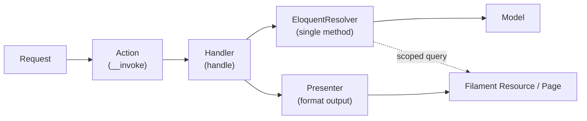

# 11 — Backend Architecture (C4 Level 3: Components & Conventions)

> This is the **component level** that `10_c4-containers.md` deliberately deferred. It describes *how the Laravel backend is structured internally* — the modular layout and the **Action → Handler → EloquentResolver** flow — plus the team's coding conventions. It stays at the **structural / naming / flow** level; **actual code patterns live in the skill** `.claude/skills/laravel-baseline/module-architecture/SKILL.md`, which the Ralph loop reads when building.
> This document **does not restate business logic** — rules live in `04_house-rules.md`, entities in `06_entity-model-abstract.md`.

---

## 0. Reconciliations applied (please confirm)

Three small points were standardized from the draft you provided; correct any that don't match your existing codebase:

1. **Spelling: `EloquentResolver`** (the draft wrote `EloqunetResolver`). If your real classes use the misspelling, say so and it'll be matched verbatim everywhere.
2. **Resolvers are per‑action, single‑method** (matching your evolved approach: "each action … one method," "the EloquentResolver … is only also one method"). The earlier draft showed a **module‑level** resolver (`UserEloquentResolver` owning *all* queries). This doc adopts the **per‑action** form (`ListAllBookingsEloquentResolver`) as the default, because it's the whole point of avoiding fat classes. 🟡 *If you actually want one resolver per module with many query methods, that's a one‑line change to the convention.*
3. **Folders:** Actions in `Http/Actions/`, Handlers in a new `Handlers/`, resolvers kept in `Repositories/` (your draft's folder) — though `Resolvers/` would read truer now that the repository concept is gone. 🟡 *pick one.*

---

## 1. Modular by domain

Every feature is a self‑contained **module** under `modules/{Name}/`, owning its entire vertical slice. You understand one module without reading the other nineteen — the boundary is **cognitive**, not a microservice.

| Layer | Location |
|---|---|
| Migrations | `Database/Migrations/` |
| Models | `Models/{Entity}Model.php` |
| Data access (Eloquent) | `Repositories/{Action}EloquentResolver.php` |
| Presentation | `Presenters/{Name}Presenter.php` |
| HTTP — validation | `Http/Requests/` |
| HTTP — entry points | `Http/Actions/{Action}Action.php` |
| Logic | `Handlers/{Action}Handler.php` |
| Admin UI | `Filament/Admin/{Resources,Pages,Widgets}/` |
| Client UI | `Filament/Client/{Resources,Pages,Widgets}/` |
| Translations | `lang/{en,ar}/{name}.php` |
| Blade | `Resources/views/` |
| Provider | `Providers/{Name}ServiceProvider.php` |

**Modules are not microservices** — they share one DB, one request cycle, and may call each other's resolvers directly.

PSR‑4 autoloading in `composer.json`:

```json
"autoload": { "psr-4": { "Modules\\": "modules/" } }
```

**Dorak's modules** map one‑to‑one onto the aggregates in `06`: `Auth`, `Brand`, `Branch`, `Chair`, `Barber`, `Affiliation`, `Service`, `Booking`, `Review`, `Job`, `Currency`, `Settings` (plus support modules as needed). One module per aggregate keeps the slice clean.

---

## 2. The Action → Handler → EloquentResolver pattern (the core)

**There is no Controller, no Service layer, and no Repository.** Those three become god‑classes as the app grows. Instead, each unit of work is **three single‑purpose, single‑method classes**, named by the **action** (never by the entity + a generic verb):

| Old way (avoided) | This codebase |
|---|---|
| `BookingController@index` | `ListAllBookingsAction` (invokable) |
| `BookingController@store` | `CreateBookingAction` |
| `BookingService` (many methods) | one `…Handler` per action, single method `handle()` |
| `BookingRepository` (many methods) | one `…EloquentResolver` per action, single Eloquent method |

### The three classes
- **Action** — a Laravel **invokable single‑action controller**, but named and filed as an *Action* and never called "Controller." It has Laravel's `__invoke`, stays thin, and does only HTTP concerns: receive the validated request, call its Handler, return via a Presenter/Resource.
- **Handler** — the **logic layer**. Same base name as its action, suffix `Handler`, exactly **one method: `handle()`**. All business logic for that one action lives here; it calls the EloquentResolver for data and enforces the relevant `04` house rules.
- **EloquentResolver** — the **only place Eloquent runs**. Same base name, suffix `EloquentResolver`, exactly **one method**. It contains nothing but the Eloquent operation for that action.

### Why
One action = one HTTP responsibility = one method in each layer. Nothing accumulates methods, so no file grows unbounded. A failed feature is three small files, not a tangled service.

### Worked example — `modules/Booking/`
- `ListAllBookingsAction` → `ListAllBookingsHandler@handle` → `ListAllBookingsEloquentResolver` → `BookingModel`
- `CreateBookingAction` → `CreateBookingHandler@handle` → `CreateBookingEloquentResolver` → `BookingModel`
  - the **no‑double‑booking** guarantee (`04` E1 / `08` EC‑1) lives in this handler + resolver, using the `concurrency-safety` skill's locking‑in‑a‑transaction pattern.

---

## 3. Layering (not strict hexagonal)

Data flows **down**; output formats on the way back up.



**Key rule — resolvers own ALL query logic.** Filament resources never write raw Eloquent. If a resource needs scoped data (e.g. a client panel showing only the current user's bookings), it calls a resolver method, not an inline query. Presenters format for output; Filament reads from presenters for infolists and from resolvers for tables.

---

## 4. Design tenets

### Explicit over magic
- **All module providers listed by name** in `bootstrap/providers.php`. No auto‑discovery.
- **`register()` is always empty.** No bindings, no deferred providers — DI resolves by class name at runtime (concrete classes, see below).
- Every `boot()` guards each `load*` call with `File::exists()` / `File::isDirectory()`. **A missing directory is not an error.**

### `final` everywhere
Every module class — provider, model, resolver, presenter, action, handler, form request — is **`final`**. **No inheritance anywhere.** Share via a **trait** or by **calling a collaborator**, never via a base class.

### No interfaces, no abstract bases
Resolvers, handlers, presenters are **concrete** classes with no `implements` and no shared base. The contract is the **method signature**, not an interface — so you cmd+click straight to the implementation. (Indirection stays low; this is deliberate.)

### `newQuery()` not `Model::query()`
Resolvers always use `$this->model->newQuery()`, never the static facade — so a resolver is testable by constructor‑injecting the model.

---

## 5. Dual Filament panels

Two panels, discovered at runtime from the filesystem:

```
app/Providers/Filament/
  ├── AdminPanelProvider.php    # /admin  — roles: admin, supervisor
  └── ClientPanelProvider.php   # /client — role: user
```

- **Filament is never registered inside module service providers.** The two panel providers scan `modules/{Module}/Filament/{Admin|Client}/{Resources,Pages,Widgets}/`.
- **Auth gating:** each panel's `authMiddleware()` runs the ban‑check middleware; model‑level access via `ClientModel::canAccessPanel()` (or the corresponding auth model for each guard).
- Panel config (id, path, brand, primary color, SPA, `SpatieTranslatablePlugin`) lives in `config/panels.php`.

> Mapped to Dorak's roles (`04` group H): **/admin** serves Platform Admin / Brand Owner / Branch Manager (with policies scoping each); **/client** serves Clients and Barbers. 🟡 *exact role→panel mapping is yours to confirm — it intersects the Open Decision on Owner‑vs‑Manager permissions (`02` §8 #4).*

---

## 6. Naming conventions

| What | Convention | Example |
|---|---|---|
| Models | `{Entity}Model` | `BookingModel`, `BranchModel` |
| Tables | explicit `$table`, snake_case plural | `$table = 'bookings'` |
| Actions | `{Verb}{Subject}Action` (invokable) | `ListAllBookingsAction`, `CreateBookingAction` |
| Handlers | `{Verb}{Subject}Handler` (one method `handle`) | `CreateBookingHandler` |
| Eloquent resolvers | `{Verb}{Subject}EloquentResolver` (one method) | `CreateBookingEloquentResolver` |
| Presenters | `{Module}Presenter` | `BookingPresenter` |
| Service providers | `{Module}ServiceProvider` | `BookingServiceProvider` |
| Translation namespace | snake_case module name | `__('booking::messages.key')` |
| View namespace | kebab‑case module name | `'booking::filament.pages.*'` |
| Migrations | `YYYY_MM_DD_000{N}_create_{table}_table.php` | stamped for ordering |

---

## 7. Translation‑first

Every module ships **both** `lang/en/` and `lang/ar/` from day one. `SpatieTranslatable` handles translatable model attributes (e.g. name, description — the "translatable" fields in `06`); the `LanguageSwitch` plugin toggles `en`/`ar` inside panels. **No hardcoded UI strings** — always translation keys, e.g. `__('booking::labels.time_slot')`.

This is the code‑level enforcement of `04` **J1/J2** (always show the user's language; fall back, never empty) and the bilingual attributes in `06`.

---

## 8. Testing

- **Pest** + **PHPUnit 11**.
- **SQLite `:memory:`** — no external DB required.
- Tests in `tests/Feature/`, `tests/Unit/`, `tests/Integration/`.
- **Factories in each module's `Database/Factories/`.**
- Run: `composer test` (clears config, runs the full suite).

The *policy* for what to test (every house rule → a test; every edge case → a test; every flow → a feature test; the flagship concurrency test) lives in `.claude/skills/laravel-baseline/testing/SKILL.md`. This section only fixes the **stack**.

---

## 9. What's absent on purpose

| Absent | Reason |
|---|---|
| **Controllers / Service layer / Repository layer** | Replaced by single‑method **Action / Handler / EloquentResolver** so no class grows unbounded |
| Service‑container bindings | Concrete classes resolved directly; no interfaces to bind |
| Abstract base classes | `final` + composition over inheritance |
| Most `Routes/web.php` | Filament handles panel routing; Actions are bound where API/web routes are needed |
| Module auto‑discovery | Explicit `providers.php` keeps boot order predictable |
| Filament in `register()` | Panel providers own discovery; modules never touch Filament |
| `app/` features (except providers) | Domain code lives in `modules/`; `app/` is only glue |

---

## 10. Guided tour

```
bootstrap/providers.php                 # Entry: all providers, in explicit order
├── Modules\Auth\...                     # sessions, password reset
├── App\Providers\...                    # rate limiting, model strict mode
├── App\Providers\Filament\...           # Admin + Client panel discovery
└── Modules\{Brand,Branch,Chair,Barber,Affiliation,Service,Booking,Review,Job,Currency,Settings}\...

modules/Booking/                         # one module = one aggregate from 06
├── Providers/BookingServiceProvider.php # loads migrations/lang/views; register() empty; boot() guards with File::exists
├── Models/BookingModel.php              # final Eloquent model
├── Http/
│   ├── Requests/CreateBookingRequest.php   # form-request validation (the input-shaped 04 rules)
│   └── Actions/
│       ├── ListAllBookingsAction.php        # invokable; thin; calls handler
│       └── CreateBookingAction.php
├── Handlers/
│   ├── ListAllBookingsHandler.php           # handle(): logic only
│   └── CreateBookingHandler.php             # enforces E1/E2 via concurrency-safety
├── Repositories/                            # (or Resolvers/) — Eloquent only
│   ├── ListAllBookingsEloquentResolver.php  # one method; newQuery()
│   └── CreateBookingEloquentResolver.php
├── Presenters/BookingPresenter.php          # output formatting
├── Database/
│   ├── Migrations/                          # module-owned tables (see migrations skill for cascades)
│   ├── Seeders/
│   └── Factories/BookingFactory.php
├── Filament/
│   ├── Admin/{Resources,Pages,Widgets}/     # admin UI (reads presenters + resolvers)
│   └── Client/{Resources,Pages,Widgets}/    # client UI
├── lang/{en,ar}/booking.php
└── Resources/views/

config/panels.php                        # panel colors, paths, brand, plugins
```

---

## 11. Why this way

- **Cognitive isolation.** N features, N directories; onboard one module at a time.
- **Small classes by construction.** Action/Handler/Resolver each hold one method — nothing becomes a 2,000‑line service.
- **No framework lock‑in.** Modules are PSR‑4 PHP classes, not Laravel magic; the pattern survives a framework change.
- **Cheap to delete.** A failed feature = delete one directory + one line in `providers.php`.
- **Dual‑panel reuse.** Admin and Client share models, resolvers, and presenters; only the Filament UI differs.
- **Translation as infrastructure.** `ar`/`en` from day one of every module.

---

## 12. How this binds to the rest of the docs & harness

- **Entities (`06`) → modules.** One module per aggregate; `{Entity}Model` per entity.
- **House rules (`04`) → handlers + tests.** Each rule is enforced in the relevant `…Handler` and proven by a test (testing skill).
- **Flows (`07`) → actions.** Each step that hits the backend is one Action.
- **Containers (`10`) → this is its inside.** `10` named the API container; this is its component structure.
- **The skill** `.claude/skills/laravel-baseline/module-architecture/SKILL.md` makes all of the above enforceable in the Ralph loop, and can carry the concrete code patterns on request.