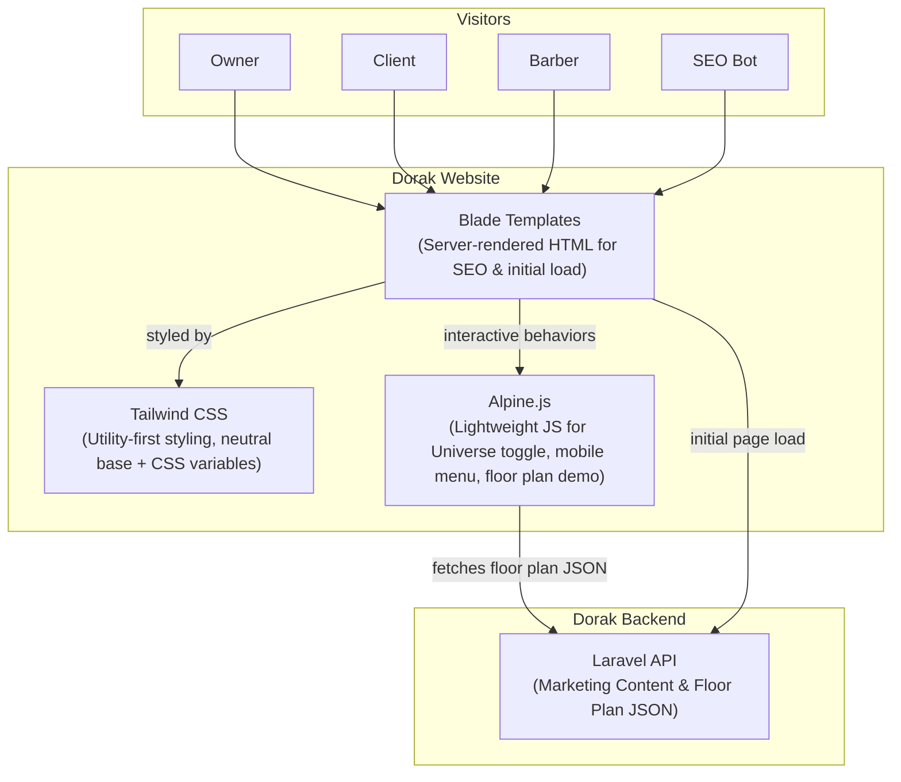

# 10 — C4 Containers (Level 2)
> **Inside the website box.** The major moving parts and how they talk.

## The Container View

The Containers (Plain English)
Blade Templates: The server-rendered HTML. Responsible for delivering the core structure, SEO metadata, and initial content instantly to the browser and bots.
Tailwind CSS: The styling engine. Configured with a neutral base palette. Uses CSS variables to allow Alpine.js to swap accent colors dynamically without reloading the page.
Alpine.js: The lightweight JavaScript layer. Handles the Universe Toggle, mobile navigation, and fetches the interactive floor-plan JSON from the API to render the demo.
Laravel API: The backend endpoint that serves the structured marketing content and the read-only floor-plan layout payload.