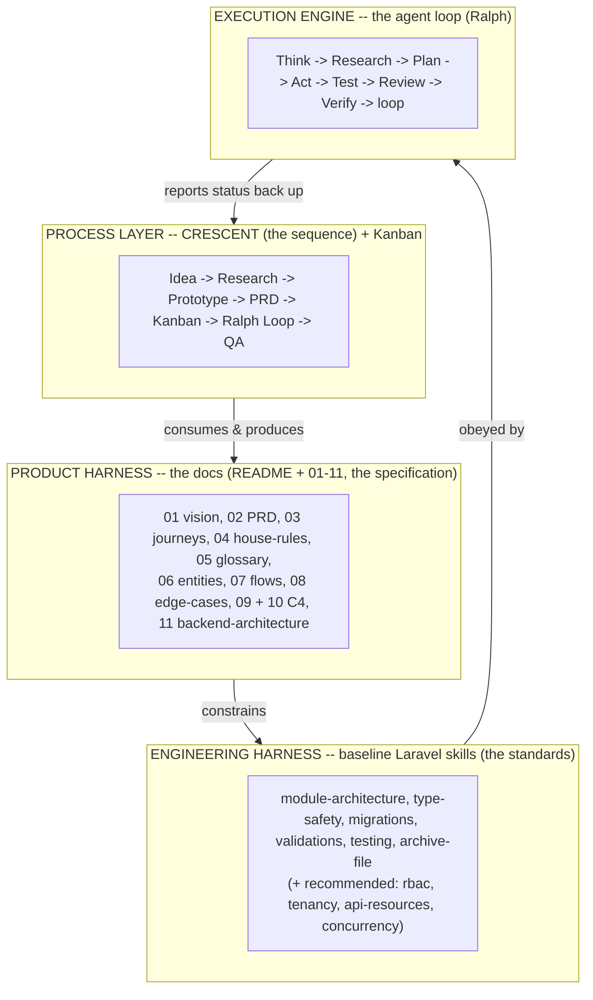

# PROCESS — How CRESCENT, the Loop, and the Laravel Baseline Skills plug into the docs

> **The gap this fills.** The `docs/` folder is a *specification* — it says **what** to build and **why**, and freezes the **laws**. It does not say **how to execute** that spec reliably with an AI agent. Your three new ideas supply exactly the three missing pieces:
>
> 1. **Harness engineering** → the *static scaffolding* the agent reads (docs + skills + rules).
> 2. **Loop engineering** → the *dynamic engine* that iterates: Think → Research → Plan → Act → Test → Review → Verify.
> 3. **CRESCENT** → the *named sequence* that orders everything: Idea → Research → Prototype → PRD → Kanban → Ralph Loop → QA.
>
> This document is the wiring diagram that connects all three to the existing docs. It is the answer to *"how do I introduce these with our README / 01–11?"*

---

## 1. The mental model — four layers of one harness

Think of it as a stack. The product spec sits in the middle; the process drives it from above; the engineering standards constrain it from below; the loop is the motor.



- **CRESCENT** doesn't replace the docs — it **reads and rewrites** them (early phases) and **verifies against** them (late phases).
- **Baseline skills** don't restate the docs — they **enforce** them in code. Every skill **cites** the docs it implements.
- **The loop** runs *inside* CRESCENT's phase 6, governed by the skills and the docs.

---

## 2. The three wiring principles (the whole idea in three sentences)

If you remember nothing else, remember these. They are what makes the four layers cohere instead of drifting apart.

1. **House rules and edge cases become tests.** Every If/Then law in `04_house-rules.md` and every scenario in `08_edge-cases.md` is turned into at least one automated test. The spec is *executable* through the test suite.
2. **Entities become schema; flows become feature tests.** `06_entity-model-abstract.md` drives migrations, enums, and DTOs; `07_user-flows.md` drives the feature/integration tests. The plain‑English objects and flows have a deterministic code counterpart.
3. **Doc IDs travel on every ticket.** Each Kanban card names the exact doc sections it implements (rule IDs, entity, flow, edge cases). Acceptance criteria are *derived from* those IDs, so "done" is defined by the spec, not by vibes.

Everything below is just these three principles, expanded.

---

## 3. CRESCENT ↔ docs mapping (which phase touches which doc)

This is the operational heart. Each phase has clear **inputs** (docs it reads), **outputs** (docs/artifacts it writes), and which **baseline skills** it invokes. The agent dispatches deterministically by phase (the orchestrator lives in `.claude/skills/crescent/SKILL.md`).

| # | Phase | What it does | Reads | Writes / updates | Baseline skills |
|---|---|---|---|---|---|
| 1 | **Idea** | Frame one feature/bug/refactor in a sentence + intent | `01`, `02` | a short *idea note*; maybe a line in `01` | — |
| 2 | **Research** | De‑risk unknowns (libraries, approaches, local constraints) | `02`, `08`, web | *research notes*; **new edge cases → `08`** | — |
| 3 | **Prototype** | A throwaway spike to validate the riskiest assumption | `06`, `07` | a spike (then **archived**) | type‑safety (loose), archive‑file |
| 4 | **PRD (slice)** | Freeze the *feature‑sized* spec | `01`,`02`,`04`,`06`,`07` | a **feature‑PRD slice**; update `02`/`04`/`06`/`07` as needed | — |
| 5 | **Kanban** | Decompose the slice into small tickets | `02`,`04`,`07`,`08` | tickets in `process/KANBAN.md` with acceptance criteria | — |
| 6 | **Ralph Loop** | Build each ticket via the iteration engine | `06`,`04`,`07` + **all skills** | code, migrations, tests | **all baseline skills** |
| 7 | **QA** | Verify the built feature against the spec | `04`,`08`,`07`, acceptance | QA report; move tickets → Done | testing, validations |

**Reading direction:** phases 1–5 mostly **write the spec down** (feeding the docs); phase 6 **consumes** it; phase 7 **checks the result against** it. The docs are both the front *and* the back gate of CRESCENT.

---

## 4. The loop in detail (CRESCENT phase 6 — "Ralph")

Your requested engine — *Think → Research → Plan → Act → Test → Review → Verify → loop* — is the body of phase 6. It runs **per ticket**.

| Step | What happens | Bound to |
|---|---|---|
| **Think** | Read the ticket and the doc IDs it cites; load only the relevant skills | the ticket; `04`/`06`/`07` |
| **Research** | *Only if* an unknown remains (new API/lib). Usually skipped — phases 2 & 4 already did the heavy research | web, sparingly |
| **Plan** | List the files to touch; name the rules/entities/flows being implemented; pick applicable skills | the cited docs + skills |
| **Act** | Write code to the skills' standards (typed, validated, migrations match cascade rules); **archive any file before a destructive change** | type‑safety, migrations, validations, archive‑file |
| **Test** | Write/run the tests the ticket demands — one per cited house rule + edge case; red → green | testing skill; `04`, `08`, `07` |
| **Review** | Self‑review against each skill's checklist + the doc rules; run static analysis | all skills |
| **Verify** | Run the **full** suite; confirm acceptance criteria; confirm **no other house rule regressed** | `04`, `08`, acceptance |
| **Loop / Done** | Any check fails → back to Plan/Act. All pass → ticket **Done**, take the next | KANBAN board |

**Stopping conditions (all must hold to mark a ticket Done):**
- every acceptance criterion met,
- every cited house rule + edge case has a passing test,
- static analysis clean at the target level,
- full suite green (no regressions elsewhere).

**Escalation guard (so the loop never spins forever):** if a ticket fails verification **N times** (you pick N, e.g. 3) or touches anything flagged 🟡 *Open* in `02_prd.md` §8, the loop **stops and asks a human**. This is deliberate — the loop is allowed to be autonomous only where the spec is *Decided* (✅), never where it's *Open* (🟡).

---

## 5. How the baseline Laravel skills attach to the docs

The skills are the **engineering harness**. They are not generic Laravel tips — each one points back at the spec so the agent builds *this* product correctly. Index lives in `.claude/skills/laravel-baseline/README.md`; two are fully worked as exemplars.

| Skill | Enforces (from the docs) | Example binding |
|---|---|---|
| **module-architecture** | the aggregates in `06`; the structure in `11` | one module per aggregate; **no controller/service/repository** — only **Action → Handler → EloquentResolver** (single-method, `final`); Filament reads via resolvers/presenters |
| **type-safety** | the fixed value lists in `06` | every `status` / `gender_category` becomes a **backed enum**, not a magic string; the floor‑plan payload (`10`) becomes a typed object |
| **migrations** | entities `06` + cascade laws `04` | brand delete **cascades** branches/chairs (rule **A6**) but a barber **survives** — only the affiliation row is removed (rule **C5**); polymorphic columns for affiliations/services/settings (`06` §4) |
| **validations** | the If/Then rules `04` + edge cases `08` | reject a 2nd branch when the `multi_branch` flag is off (**A3/I2**); validate both `ar` **and** `en` on translatable fields (**J1/J2**) |
| **testing** | `04` + `08` + `07` | the **no‑double‑booking** concurrency test (**E1 / EC‑1**); tenancy‑isolation test (**H7**); a feature test per flow in `07` |
| **archive-file** | the loop's safety | snapshot a file/data into `archive/` before any destructive edit or reversible‑down migration, with a changelog line |

**The rule of thumb:** *a skill may only tell the agent to do something the docs already require.* If a skill wants new behavior, that behavior must first be written into the docs (via a CRESCENT PRD phase). This keeps the spec the single source of truth and prevents the skills from quietly inventing product decisions.

> **Recommended additions** the docs imply but your list didn't name: **rbac/authorization-policies** (encode `04` group H), **tenancy-isolation** (rule H7), **api-resources / backend-driven-ui** (the typed floor‑plan payload from `10`), and **concurrency-safety** (the booking guarantee E1). I've noted these in the baseline README so they're not forgotten.

---

## 6. The Kanban — the bridge from spec to execution

CRESCENT phase 5 produces the board; phase 6 consumes it; phase 7 closes it. Full board model + ticket template + a worked example live in `process/KANBAN.md`. The essential idea:

- A ticket is **small** (one loop pass should plausibly finish it).
- A ticket **carries its doc IDs** — the entity it touches (`06`), the rules it must satisfy (`04`), the flow it implements (`07`), the edge cases it must cover (`08`).
- A ticket's **acceptance criteria are generated from those IDs**, so QA (phase 7) is a mechanical check against the spec, not a judgement call.
- Columns map to the lifecycle: **Backlog → Ready → In Progress (the loop) → In Review/QA → Done**, plus **Blocked** (where 🟡 Open items wait for your decision).

---

## 7. Where this physically lives (folder layout)

The three new layers sit **beside** `docs/`, never inside it — the spec stays clean and tool‑agnostic, the process/skills are the executable wrapper around it.

```
repo-root/
├── docs/                          # the product docs (the spec) — README + 01..11
│   ├── README.md ... 11_backend-architecture.md
├── modules/                       # the actual app code (see docs/11) — one module per aggregate
│   └── {Brand,Branch,Chair,Barber,Booking,...}/   # Action/Handler/EloquentResolver + Filament + lang
├── process/                       # CRESCENT process layer
│   ├── PROCESS.md                 # this file — the wiring diagram
│   └── KANBAN.md                  # board model + ticket template + example
└── .claude/
    └── skills/
        ├── crescent/
        │   └── SKILL.md           # the 7-phase orchestrator (state machine)
        └── laravel-baseline/      # the engineering harness
            ├── README.md              # index of baseline skills + recommended additions
            ├── module-architecture/SKILL.md  # worked — modules + Action/Handler/EloquentResolver (mirrors docs/11)
            ├── migrations/SKILL.md    # worked — schema + cascade laws
            ├── testing/SKILL.md       # worked — house-rules -> tests
            ├── type-safety/SKILL.md   # (to scaffold)
            ├── validations/SKILL.md   # (to scaffold)
            └── archive-file/SKILL.md  # (to scaffold)
```

> The CRESCENT *phase* skills (idea, research, prototype, prd, kanban, ralph-loop, qa) can each be their own skill under `.claude/skills/crescent-phases/` if you want the orchestrator to dispatch to separate files; for now the orchestrator `SKILL.md` describes all seven inline. Splitting them out is a small follow‑up.

---

## 8. What's yours to decide (so the loop knows its limits) 🟡

These shape how autonomous the engine is allowed to be. Decide them once and the orchestrator/skills can encode them:

1. **Autonomy per phase:** which CRESCENT phases run unattended vs. require your sign‑off (suggested gate points: after **PRD**, after **Kanban**, and at **QA**).
2. **Loop escalation N:** how many failed verifications before the loop stops and asks (suggested: 3).
3. **Prototype policy:** is every spike *always* archived/deleted after phase 3, or can a spike graduate into real code?
4. **Static‑analysis bar:** the target level for the type‑safety skill (e.g., the strictest level your team can sustain).
5. **QA automation:** is phase 7 fully automated (suite + checks), or a human review against `04`/`08`?
6. **Skill split:** keep the seven phases inline in the orchestrator, or break them into separate phase skills?

Everything in the docs flagged 🟡 (`02_prd.md` §8) remains **off‑limits to autonomous building** until you resolve it — the loop must route those to a human.

---

## 9. One‑paragraph summary

Your 11 docs are the **specification**. **CRESCENT** is the **sequence** that writes that spec down (Idea→Research→Prototype→PRD), turns it into work (Kanban), builds it (the Ralph **loop**), and checks it back against itself (QA). The **baseline Laravel skills** are the **standards** the loop must obey, and each one is anchored to a specific part of the spec — so house rules become tests, entities become schema, and flows become feature tests. The harness is everything the agent reads (docs + skills); the loop is the motor; CRESCENT is the gearbox that puts them in the right order.

**See also:** `.claude/skills/crescent/SKILL.md` (the runnable orchestrator), `process/KANBAN.md` (the board + ticket template), `.claude/skills/laravel-baseline/README.md` (the standards index).